--- 
pagetitle: "Week 2 - Data analysis type and structure"
---

# Week 2

## Week 2 Learning objectives

:::keyidea
At the end of this lesson you will be able to: 

* Define the steps in a data analysis 
* Structure a data science project
* Identify the difference between the levels of an analysis
        - Raw
        - Informal
        - Formal
* Identify the steps between raw, informal and formal analysis 
:::


## The steps in a data analysis

Recall from week 1 the definition of data science:

> Data science is the process of formulating a quantitative question that can be answered with data, collecting and cleaning the data, analyzing the data, and communicating the answer to the question to a relevant audience.

When people talk about data science they often think of big data, or complicated statistical machine learning tools. But [the key word in data science is not data, it is science](https://simplystatistics.org/2013/12/12/the-key-word-in-data-science-is-not-data-it-is-science/). Specifically the fastest way to end up with an unsuccessful data science project is to start with the data or tools. Good data science almost invariably starts with a good question. 

Most data science projects follow a common set of steps: 

1. Define the question
2. Define the ideal data set
3. Determine what data you can access
4. Obtain the data
5. Clean the data
6. Exploratory data analysis
7. Statistical prediction/modeling
8. Interpret results
9. Challenge results
10. Synthesize/write up results
11. Create reproducible code

These steps might vary somewhat depending on the context of the project, but are remarkably consistent across projects in both industry and academia. To illustrate this process I'm going to use a simple, somewhat contrived, example - but it can equally be applied to any new data science project you start.  

### Defining the question

The difference between real success and failure in data analysis often comes down to the question. The key to settling on a good question is to first start without thinking about the data that you have. Think only about the question you care about. It has been suggested that [data makes the scientific method obsolete](https://www.wired.com/2008/06/pb-theory/) - but the reality is that [big data makes careful scientific thinking more important, not less](https://psmag.com/education/how-big-data-impacts-scientific-research). 

Regardless of who is involved in the question definition process there are four criteria that help define a good data science question. 

1. It should be specific 
2. It should be answerable with data
3. It should be answerable with the data you have
4. It should not be designed to discriminate or cause harm
5. It should come with a definition of success 


So we might start with a general question - something like:

> Is it possible to consistently label hand-drawn images of hardware using a simple model? 

This question could be of interest if, for example, you are building a hand-drawn search feature for a hardware store app or website. Note that this question was defined without thinking about what data we might collect, what data we have on hand, or really any of the potential constraints. It is generally a good idea to start with the question you really care about - ignoring these constraints - and work down to a more specific, answerable question. 


### Defining the ideal data set 

The ideal data set might be a large collection of hand drawn images, labeled with the intention of each of the people who made the drawing. This kind of data would allow you to directly develop a classification algorithm and measure its success. However, this might also be an expensive data set to collect. You would need to pay people to make the drawings and take the time to go through your inventory with them to get them to provide gold standard labels. 

This might be well beyond the resources you have available to you - so you might have to settle for a less than ideal data set. However, it is always important to consider what ideal looks like. At a minimum, this will allow you to identify specific, concrete potential limitations of the data you end up using. 


### Determine the data you can access

If you hadn't already collected data to answer this question, you might go looking for convenience data. For example you might land on the [Google Quickdraw](https://quickdraw.withgoogle.com/) project. The QuickDraw project asks people to draw pictures of different objects and then uses a neural network to predict what has been drawn. 

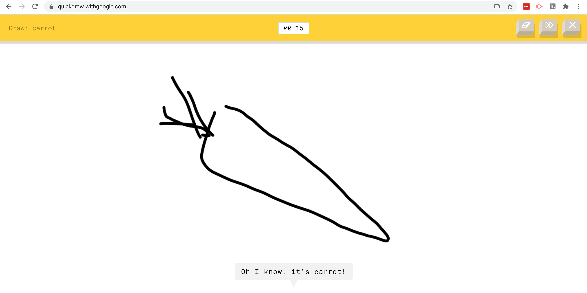

The data consist of a large number of hand drawn images and the neural-network predicted labels for those objects from Google. 


So in applying the criteria above we need to refine our question to be more specific and answerable with the data we have in hand: 

>  Can we classify images based on the data collected by QuickDraw into labeled categories from the neural network?

Sometimes this would be where the data science project may stop. The question may either not be answerable with data at all - or we may not have sufficiently good data to answer the question. Expert data scientists learn through years of practice to identify questions that are likely to lead to fruitful conclusions. For example, in this case past experience has shown that classification of images with high-accuracy is [quite possible - at least with complicated models.](https://paperswithcode.com/sota/image-classification-on-imagenet). 


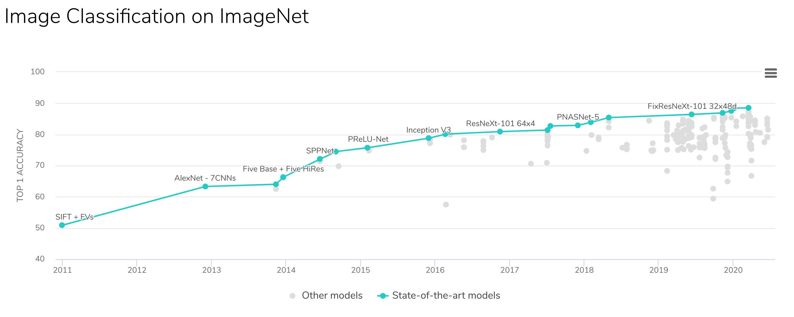

While this data is large and potentially incredibly useful for the question we originally set out to answer, it also has some limitations. Since we defined the ideal data set to start, we can use that as a way to highlight potential limitations of our analysis. 

For example: 

- The data were collected on the internet at large, and not necessarily from the potential customers at the hardware store. 
- The labels are not defined by the the artist, but by the neural network from Google and so may be inaccurate. 
- The pictures represent a large collection of objects, not simply hardware, and so may not reflect all of the types of images you may see in practice. 


Another important question is whether the proposed application is ethical or a good idea. There are entire courses on the [ethics of data science](https://www.fast.ai/2020/08/19/data-ethics/) and we will cover this in more detail later in the course. But for this simple example - we might also want to consider relevant questions such as: 

- How will this classifier work for people with disabilities? 
- Are there cultural differences that will make the classifier work better for certain groups of people? 
- What should happen if a person draws something inappropriate? 

Despite these limitations and considerations, this data is public, free, and large, so represents an opportunity to start to answer our question. Here we will make the question even more specific, simply for ease of exposition. We will narrow the set of data to the hand drawn images of axes and clouds and see if we can separate the two. 

The final step in defining the question is coming up with the definition of success. It is critically important to do this before you start and will depend heavily on the context. For example, in our simple case we might only need classification accuracy of 80% for the project to be successful - 4 out of 5 customers will be directed to the right project and the other won't be harmed. But if you are building a self-driving car, you might need to be [significantly more accurate](https://www.vox.com/recode/2020/2/26/21154502/tesla-autopilot-fatal-crashes)! 
However, using this definition of success we can write down our final question: 


>  Can we classify images of clouds and axes to 80% accuracy based on the data collected by QuickDraw into labeled categories from the neural network?

This question only answers a fraction of our initial, broad question. That is often the case! Most data science problems start out with a major open question and narrow down to a question answerable with a given data set. 


One important consideration we have not discussed here is that as a data scientist you are often not the only person involved in the definition of the question. It may be driven by a scientific collaborator, a project manager, or an executive in industry. The process should still be the same - moving from an important content driven question and drilling down to a specific, answerable data science question. It is generally helpful in these conversations to be open about the entire process of question definition - from generality to specificity. This process may involve significant iteration and will require good communication between you and your collaborators or managers. Often the most difficult part of this process is managing expectations - people without significant data analysis expertise will often expect the data to be capable of answering more, or harder, questions than they actually can. 


### Obtain the data

Now that we have defined our question, we need to obtain some data. In this case, the QuickDraw data are [publicly available](https://github.com/googlecreativelab/quickdraw-dataset). You can download them from the web. This process also might involve pulling data from an API, accessing a database and sampling data, or collecting the data directly. Having a variety of tools at your disposal for collecting (sometimes called pulling) data is an important component of your toolbox as a data scientist. 

:::resources
There are a number of courses and resources focused on getting data including: 

- [Getting and cleaning data](https://www.coursera.org/learn/data-cleaning)
- [Getting data](https://leanpub.com/universities/courses/jhu/cbds-getting-data)
- [Databases using dplyr](https://db.rstudio.com/dplyr/)
- [Data scraping in R](https://github.com/simonmunzert/rscraping-jsm-2016)
:::

In our simple example, I have downloaded and subsampled the data to make them usable for this analysis. One important thing I haven't done - but is a good idea in general - is to write code that will automatically and reproducibly pull the data from the source. Including this step as a component of your data analytic code will save you a lot of time in the future when a collaborator asks you to update your analysis with the latest data. We will discuss this more when we talk about structuring data science projects. 


### Clean the data

It has been said that data science is 80% data cleaning and that continues to hold true (at least if the data scientists on Twitter are to be trusted):

<blockquote class="twitter-tweet"><p lang="en" dir="ltr">Have been extremely curious about this for a while now, so I decided to create a poll. <br>&quot;As someone titled &#39;data scientist&#39; in 2019, I spend most of (60%+) my time:&quot; <br>(&quot;Other&quot;) also welcome, add it in the replies.</p>&mdash; Vicki Boykis (@vboykis) <a href="https://twitter.com/vboykis/status/1089920316644704256?ref_src=twsrc%5Etfw">January 28, 2019</a></blockquote> <script async src="https://platform.twitter.com/widgets.js" charset="utf-8"></script>

Data cleaning is one of the hardest things to teach. The reason is best summed up in this quote by [Hadley Wickham](https://vita.had.co.nz/papers/tidy-data.pdf) with apologies to Tolstoy: 

>  tidy datasets are all alike but every messy dataset is messy in its own way.

Each type of data you encounter will have different steps involved in the process. But data cleaning always involves identifying and cataloging data quirks, iconsistencies, and errors and reformatting or reshaping data to the form needed for analysis. 


In our simple example we can find the data here: https://github.com/jtleek/ads2020/tree/master/docs/resources/week2/. In cases where the data are large or unwieldy an important principle is to make the data small enough to work with. Here we do that by random sampling: 

<blockquote class="twitter-tweet"><p lang="en" dir="ltr">Robert Gentleman, Genentech: &quot;make big data as small as possible as quick as is possible&quot; to enable sharing <a href="https://twitter.com/hashtag/bigdatamed?src=hash&amp;ref_src=twsrc%5Etfw">#bigdatamed</a></p>&mdash; Ellie McDonagh (@EllieMcDonagh) <a href="https://twitter.com/EllieMcDonagh/status/469184554549248000?ref_src=twsrc%5Etfw">May 21, 2014</a></blockquote> <script async src="https://platform.twitter.com/widgets.js" charset="utf-8"></script>


```r
library(LaF)
library(here)
axes_json = sample_lines(here::here("docs/resources/week2/axes.ndjson"),100)
clouds_json = sample_lines(here::here("docs/resources/week2/clouds.ndjson"),100)
axes_json[[1]]
```

```
## [1] "{\"word\":\"axe\",\"countrycode\":\"US\",\"timestamp\":\"2017-01-28 00:05:29.6737 UTC\",\"recognized\":true,\"key_id\":\"4956324926324736\",\"drawing\":[[[160,160,155,132,118,77,54,0,13,20,29,29,42,70,104,128],[255,233,196,121,48,23,13,0,52,124,149,162,139,114,94,89]]]}"
```

The next thing I did was google “quick draw data ndjson rstats”. I found a [tutorial](https://fronkonstin.com/2018/07/01/exploring-the-quick-draw-dataset-with-r-the-mona-lisa/) and lifted some code for processing ndjson data into data frames. This is a common step in data cleaning - since it is so bespoke by data type you will often want to use Google to search for the data type and the type of cleaning you want to do. 


```r
library(dplyr)

parse_drawing = function(list)
{
  lapply(list$drawing, function(z) {data_frame(x=z[[1]], y=z[[2]])}) %>% 
    bind_rows(.id = "line") %>% mutate(drawing=list$key_id, row_id=row_number())
}
first_axe = rjson::fromJSON(axes_json[[1]]) %>% parse_drawing()
first_axe
```

```
## # A tibble: 16 x 5
##    line      x     y drawing          row_id
##    <chr> <dbl> <dbl> <chr>             <int>
##  1 1       160   255 4956324926324736      1
##  2 1       160   233 4956324926324736      2
##  3 1       155   196 4956324926324736      3
##  4 1       132   121 4956324926324736      4
##  5 1       118    48 4956324926324736      5
##  6 1        77    23 4956324926324736      6
##  7 1        54    13 4956324926324736      7
##  8 1         0     0 4956324926324736      8
##  9 1        13    52 4956324926324736      9
## 10 1        20   124 4956324926324736     10
## 11 1        29   149 4956324926324736     11
## 12 1        29   162 4956324926324736     12
## 13 1        42   139 4956324926324736     13
## 14 1        70   114 4956324926324736     14
## 15 1       104    94 4956324926324736     15
## 16 1       128    89 4956324926324736     16
```


### Exploratory data analysis 

Now that we have cleaned the data up into a format we can use we can start to explore the data. For most data analysis projects, exploratory data analysis and data cleaning will go hand-in-hand and it will often be iterative between the two steps. The key point is that you should use EDA to discover issues with the data, sources of variation, and key factors you must account for in downstream analysis. 

The process is very similar to the parable of the [blind men and the elephant](https://en.wikipedia.org/wiki/Blind_men_and_an_elephant):


> A group of blind men heard that a strange animal, called an elephant, had been brought to the town, but none of them were aware of its shape and form. Out of curiosity, they said: "We must inspect and know it by touch, of which we are capable". So, they sought it out, and when they found it they groped about it. The first person, whose hand landed on the trunk, said, "This being is like a thick snake". For another one whose hand reached its ear, it seemed like a kind of fan. As for another person, whose hand was upon its leg, said, the elephant is a pillar like a tree-trunk. The blind man who placed his hand upon its side said the elephant, "is a wall". Another who felt its tail, described it as a rope. The last felt its tusk, stating the elephant is that which is hard, smooth and like a spear.

Similarly, when doing your initial data cleaning you will be looking at different parts of the data and trying to get a mental picture of the complete data set before moving on to modeling. 

Here we can do some simple EDA and look at a plot of one of the axes


```r
library(ggplot2)
ggplot(first_axe,aes(x, y)) +
    geom_point() + 
    scale_x_continuous(limits=c(0, 255))+
    scale_y_reverse(limits=c(255, 0))+
    theme_minimal()
```

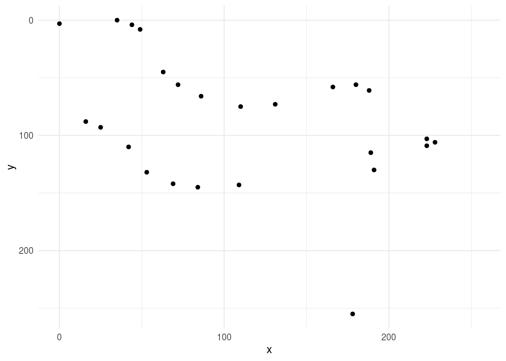

then we might fill in the lines to get a better idea of what the drawing looks like to the customer: 


```r
ggplot(first_axe,aes(x, y)) +
    geom_path(aes(group = line), lwd=1)+
    scale_x_continuous(limits=c(0, 255))+
    scale_y_reverse(limits=c(255, 0))+
    theme_minimal()
```

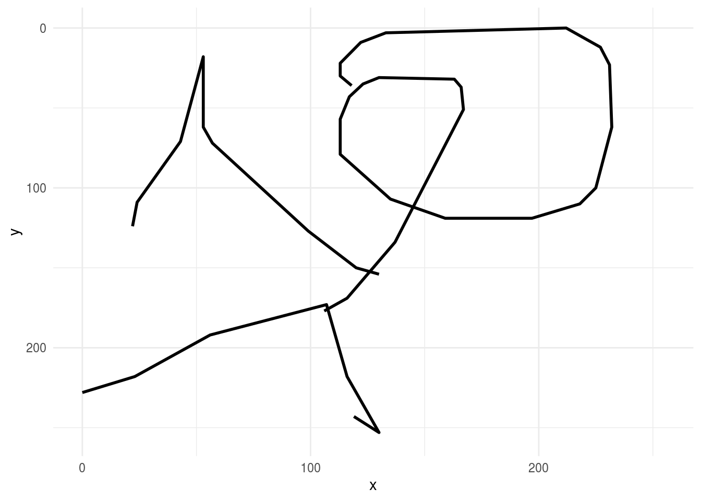

then we might look at a few more axes to get a handle on the variation in the data set: 


```r
rjson::fromJSON(axes_json[[2]]) %>% 
    parse_drawing() %>% 
    ggplot(aes(x, y)) +
    geom_path(aes(group = line), lwd=1)+
    scale_x_continuous(limits=c(0, 255))+
    scale_y_reverse(limits=c(255, 0))+
    theme_minimal()
```

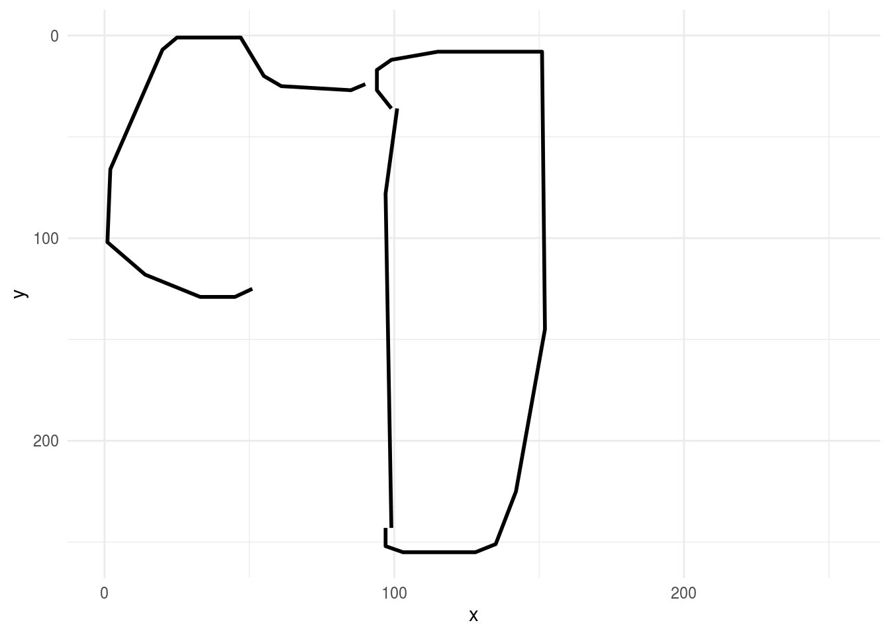

then compare these drawings to drawings of clouds


```r
rjson::fromJSON(clouds_json[[1]]) %>% 
    parse_drawing() %>% 
    ggplot(aes(x, y)) +
    geom_path(aes(group = line), lwd=1)+
    scale_x_continuous(limits=c(0, 255))+
    scale_y_reverse(limits=c(255, 0))+
    theme_minimal()
```

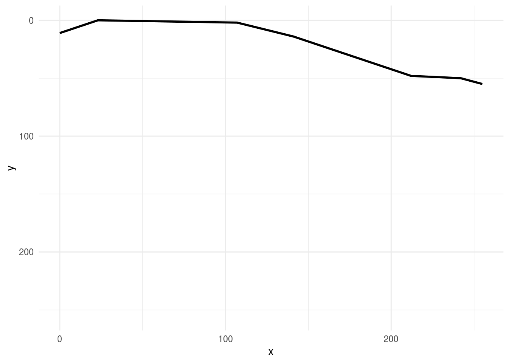

A bunch of data processing has been done for us, but the data aren’t quite ready to be fed into an algorithm yet. To do that, we’d need a data frame with each row equal to one drawing and each column equal to one feature for that drawing, with an extra column for the drawing output.

Can we think of how we’d do that for a data set like this?

Here are two things I thought of:

- I need the points sampled on a regular grid
- I need the points to be of a manageable size

Note that these are semi-arbitrary choices. A lot of data processing is based on the intuition/best guess of the analyst. While this shouldn't be a cause for alarm, it is important that you document all of these choices as they may have an impact on the answers you ultimately obtain; these choices may need to be explored and explained when interpreting your results. 


```r
# Let’s start by creating a regular grid of 256 x and y values.
library(tibble)
grid_dat = as.tibble(expand.grid(x = 1:256,y=1:256))

# Now we could make each x,y value be a grid point with a join - this is overkill
grid_axe = left_join(grid_dat,first_axe)

# Let’s add an indicator of whether a particular value is zero or not.
grid_axe = grid_axe %>%
   mutate(pixel = ifelse(is.na(line),0,1))

# subsample to a smaller size
library(Hmisc)
grid_axe$xgroup = cut2(grid_axe$x,g=16,levels.mean=TRUE)
grid_axe$ygroup = cut2(grid_axe$y,g=16,levels.mean=TRUE)
grid_axe
```

```
## # A tibble: 65,536 x 8
##        x     y line  drawing row_id pixel xgroup  ygroup 
##    <dbl> <dbl> <chr> <chr>    <int> <dbl> <fct>   <fct>  
##  1     1     1 <NA>  <NA>        NA     0 "  8.5" "  8.5"
##  2     2     1 <NA>  <NA>        NA     0 "  8.5" "  8.5"
##  3     3     1 <NA>  <NA>        NA     0 "  8.5" "  8.5"
##  4     4     1 <NA>  <NA>        NA     0 "  8.5" "  8.5"
##  5     5     1 <NA>  <NA>        NA     0 "  8.5" "  8.5"
##  6     6     1 <NA>  <NA>        NA     0 "  8.5" "  8.5"
##  7     7     1 <NA>  <NA>        NA     0 "  8.5" "  8.5"
##  8     8     1 <NA>  <NA>        NA     0 "  8.5" "  8.5"
##  9     9     1 <NA>  <NA>        NA     0 "  8.5" "  8.5"
## 10    10     1 <NA>  <NA>        NA     0 "  8.5" "  8.5"
## # … with 65,526 more rows
```

```r
# Now I can convert these to numbers so we’ll have them later

grid_axe = grid_axe %>% 
    mutate(xgroup = as.numeric(as.character(xgroup)) - 7.5) %>%
    mutate(ygroup = as.numeric(as.character(ygroup)) - 7.5)

# Then average within groups of pixels to get a smaller value

small_axe = grid_axe %>% 
    group_by(xgroup,ygroup) %>%
    summarise(pixel=mean(pixel))

small_axe
```

```
## # A tibble: 256 x 3
## # Groups:   xgroup [16]
##    xgroup ygroup   pixel
##     <dbl>  <dbl>   <dbl>
##  1      1      1 0      
##  2      1     17 0      
##  3      1     33 0      
##  4      1     49 0.00391
##  5      1     65 0      
##  6      1     81 0      
##  7      1     97 0      
##  8      1    113 0      
##  9      1    129 0      
## 10      1    145 0      
## # … with 246 more rows
```

Remember this was our original axe


```r
ggplot(first_axe,aes(x, y)) +
    geom_point() +
    scale_x_continuous(limits=c(0, 255))+
    scale_y_reverse(limits=c(255, 0))+
    theme_minimal()
```

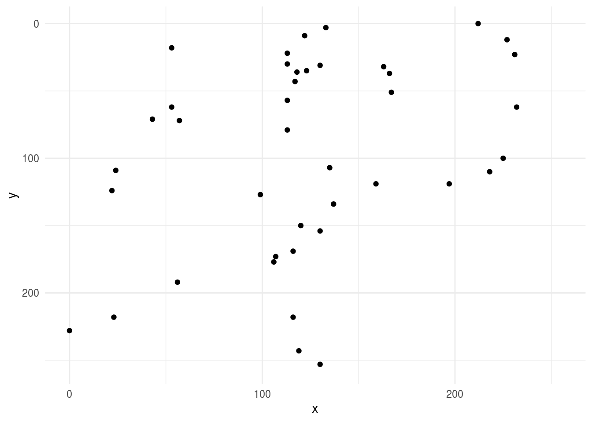

Now we can look at the small version - after cleaning, sampling to a grid, downsampling to shrink the data and averaging pixels - it looks similar - whew! :)


```r
ggplot(small_axe %>% filter(pixel > 0),aes(xgroup, ygroup)) +
    geom_point() +
    scale_x_continuous(limits=c(0, 255))+
    scale_y_reverse(limits=c(255, 0))+
    theme_minimal()
```

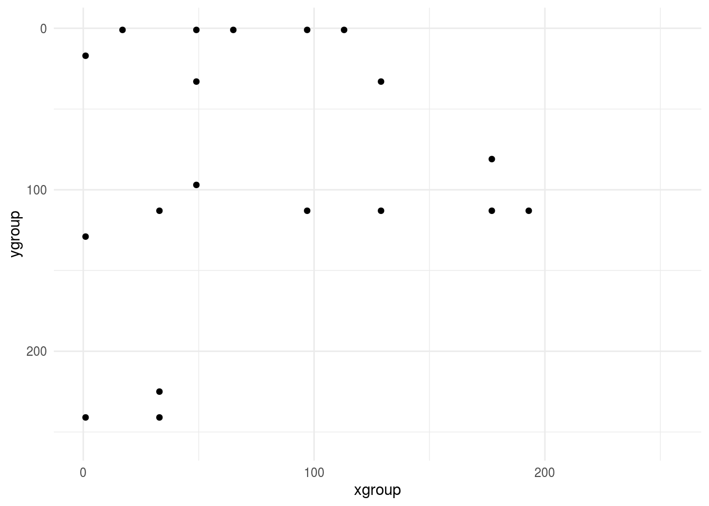

This is obviously glossing over a lot of exploration and cleaning, remember this should be 80% of the analysis! But it is a fair representation of the kinds of steps you might go through to get the data ready to model. Now let’s do this for all axes and clouds.


```r
img_dat = tibble(pixel=NA,type=NA,drawing=NA,pixel_number=NA)

## Axes
for(i in 1:100){
    tmp_draw = rjson::fromJSON(axes_json[[i]]) %>% parse_drawing()
    
    grid_draw = left_join(grid_dat,tmp_draw) %>%
           mutate(pixel = ifelse(is.na(line),0,1)) 
    
    grid_draw$xgroup = cut2(grid_draw$x,g=16,levels.mean=TRUE)
    grid_draw$ygroup = cut2(grid_draw$y,g=16,levels.mean=TRUE)
    
    small_draw = grid_draw %>% 
        mutate(xgroup = as.numeric(as.character(xgroup)) - 7.5) %>%
        mutate(ygroup = as.numeric(as.character(ygroup)) - 7.5) %>%
    group_by(xgroup,ygroup) %>%
    summarise(pixel=mean(pixel)) %>% ungroup() %>%
        select(pixel) %>%
        mutate(type="axe",drawing=i,pixel_number=row_number())
    img_dat = img_dat %>% bind_rows(small_draw)
}

## Clouds
for(i in 1:100){
    tmp_draw = rjson::fromJSON(clouds_json[[i]]) %>% parse_drawing()
    
    grid_draw = left_join(grid_dat,tmp_draw) %>%
           mutate(pixel = ifelse(is.na(line),0,1)) 
    
    grid_draw$xgroup = cut2(grid_draw$x,g=16,levels.mean=TRUE)
    grid_draw$ygroup = cut2(grid_draw$y,g=16,levels.mean=TRUE)
    
    small_draw = grid_draw %>% 
        mutate(xgroup = as.numeric(as.character(xgroup)) - 7.5) %>%
        mutate(ygroup = as.numeric(as.character(ygroup)) - 7.5) %>%
    group_by(xgroup,ygroup) %>%
    summarise(pixel=mean(pixel)) %>% ungroup() %>%
        select(pixel) %>%
        mutate(type="cloud",drawing=i,pixel_number=row_number())
    img_dat = img_dat %>% bind_rows(small_draw)
}
```


```r
library(tidyr)
img_final = spread(img_dat[-1,],pixel_number,pixel)
names(img_final) = c("type","drawing",paste0("pixel",1:256))
img_final 
```

```
## # A tibble: 200 x 258
##    type  drawing  pixel1  pixel2  pixel3 pixel4  pixel5  pixel6  pixel7 pixel8
##    <chr>   <int>   <dbl>   <dbl>   <dbl>  <dbl>   <dbl>   <dbl>   <dbl>  <dbl>
##  1 axe         1 0       0       0.0232       0 0       0       0            0
##  2 axe         2 0       0.00368 0            0 0       0       0            0
##  3 axe         3 0.00391 0       0            0 0       0       0.00781      0
##  4 axe         4 0       0       0            0 0       0       0            0
##  5 axe         5 0       0.00781 0.00391      0 0       0       0            0
##  6 axe         6 0.00368 0       0            0 0       0       0            0
##  7 axe         7 0.00391 0.00391 0            0 0       0       0            0
##  8 axe         8 0       0       0            0 0.00391 0.00391 0            0
##  9 axe         9 0       0       0            0 0.00391 0       0            0
## 10 axe        10 0       0       0            0 0       0.00368 0            0
## # … with 190 more rows, and 248 more variables: pixel9 <dbl>, pixel10 <dbl>,
## #   pixel11 <dbl>, pixel12 <dbl>, pixel13 <dbl>, pixel14 <dbl>, pixel15 <dbl>,
## #   pixel16 <dbl>, pixel17 <dbl>, pixel18 <dbl>, pixel19 <dbl>, pixel20 <dbl>,
## #   pixel21 <dbl>, pixel22 <dbl>, pixel23 <dbl>, pixel24 <dbl>, pixel25 <dbl>,
## #   pixel26 <dbl>, pixel27 <dbl>, pixel28 <dbl>, pixel29 <dbl>, pixel30 <dbl>,
## #   pixel31 <dbl>, pixel32 <dbl>, pixel33 <dbl>, pixel34 <dbl>, pixel35 <dbl>,
## #   pixel36 <dbl>, pixel37 <dbl>, pixel38 <dbl>, pixel39 <dbl>, pixel40 <dbl>,
## #   pixel41 <dbl>, pixel42 <dbl>, pixel43 <dbl>, pixel44 <dbl>, pixel45 <dbl>,
## #   pixel46 <dbl>, pixel47 <dbl>, pixel48 <dbl>, pixel49 <dbl>, pixel50 <dbl>,
## #   pixel51 <dbl>, pixel52 <dbl>, pixel53 <dbl>, pixel54 <dbl>, pixel55 <dbl>,
## #   pixel56 <dbl>, pixel57 <dbl>, pixel58 <dbl>, pixel59 <dbl>, pixel60 <dbl>,
## #   pixel61 <dbl>, pixel62 <dbl>, pixel63 <dbl>, pixel64 <dbl>, pixel65 <dbl>,
## #   pixel66 <dbl>, pixel67 <dbl>, pixel68 <dbl>, pixel69 <dbl>, pixel70 <dbl>,
## #   pixel71 <dbl>, pixel72 <dbl>, pixel73 <dbl>, pixel74 <dbl>, pixel75 <dbl>,
## #   pixel76 <dbl>, pixel77 <dbl>, pixel78 <dbl>, pixel79 <dbl>, pixel80 <dbl>,
## #   pixel81 <dbl>, pixel82 <dbl>, pixel83 <dbl>, pixel84 <dbl>, pixel85 <dbl>,
## #   pixel86 <dbl>, pixel87 <dbl>, pixel88 <dbl>, pixel89 <dbl>, pixel90 <dbl>,
## #   pixel91 <dbl>, pixel92 <dbl>, pixel93 <dbl>, pixel94 <dbl>, pixel95 <dbl>,
## #   pixel96 <dbl>, pixel97 <dbl>, pixel98 <dbl>, pixel99 <dbl>, pixel100 <dbl>,
## #   pixel101 <dbl>, pixel102 <dbl>, pixel103 <dbl>, pixel104 <dbl>,
## #   pixel105 <dbl>, pixel106 <dbl>, pixel107 <dbl>, pixel108 <dbl>, …
```

Since this is a prediction problem, we will need to split the data into a training and a testing set. We will learn more about the structure of machine learning vs inference problems later in the course. For now, you can just take my word for it that if we build a model in the training set, we will need a held out set of independent data to validate and critique our model. 


```r
library(caret)
train_set = createDataPartition(img_final$type,list=FALSE)

train_dat = img_final[train_set,]
test_dat = img_final[-train_set,]

train_dat
```

```
## # A tibble: 100 x 258
##    type  drawing  pixel1  pixel2 pixel3  pixel4  pixel5  pixel6  pixel7 pixel8
##    <chr>   <int>   <dbl>   <dbl>  <dbl>   <dbl>   <dbl>   <dbl>   <dbl>  <dbl>
##  1 axe         2 0       0.00368      0 0       0       0       0            0
##  2 axe         3 0.00391 0            0 0       0       0       0.00781      0
##  3 axe         4 0       0            0 0       0       0       0            0
##  4 axe         8 0       0            0 0       0.00391 0.00391 0            0
##  5 axe         9 0       0            0 0       0.00391 0       0            0
##  6 axe        10 0       0            0 0       0       0.00368 0            0
##  7 axe        11 0       0            0 0       0.00781 0       0            0
##  8 axe        13 0.00368 0            0 0       0       0.00368 0            0
##  9 axe        14 0       0.00391      0 0       0       0       0            0
## 10 axe        15 0.00391 0.0156       0 0.00391 0.00391 0       0            0
## # … with 90 more rows, and 248 more variables: pixel9 <dbl>, pixel10 <dbl>,
## #   pixel11 <dbl>, pixel12 <dbl>, pixel13 <dbl>, pixel14 <dbl>, pixel15 <dbl>,
## #   pixel16 <dbl>, pixel17 <dbl>, pixel18 <dbl>, pixel19 <dbl>, pixel20 <dbl>,
## #   pixel21 <dbl>, pixel22 <dbl>, pixel23 <dbl>, pixel24 <dbl>, pixel25 <dbl>,
## #   pixel26 <dbl>, pixel27 <dbl>, pixel28 <dbl>, pixel29 <dbl>, pixel30 <dbl>,
## #   pixel31 <dbl>, pixel32 <dbl>, pixel33 <dbl>, pixel34 <dbl>, pixel35 <dbl>,
## #   pixel36 <dbl>, pixel37 <dbl>, pixel38 <dbl>, pixel39 <dbl>, pixel40 <dbl>,
## #   pixel41 <dbl>, pixel42 <dbl>, pixel43 <dbl>, pixel44 <dbl>, pixel45 <dbl>,
## #   pixel46 <dbl>, pixel47 <dbl>, pixel48 <dbl>, pixel49 <dbl>, pixel50 <dbl>,
## #   pixel51 <dbl>, pixel52 <dbl>, pixel53 <dbl>, pixel54 <dbl>, pixel55 <dbl>,
## #   pixel56 <dbl>, pixel57 <dbl>, pixel58 <dbl>, pixel59 <dbl>, pixel60 <dbl>,
## #   pixel61 <dbl>, pixel62 <dbl>, pixel63 <dbl>, pixel64 <dbl>, pixel65 <dbl>,
## #   pixel66 <dbl>, pixel67 <dbl>, pixel68 <dbl>, pixel69 <dbl>, pixel70 <dbl>,
## #   pixel71 <dbl>, pixel72 <dbl>, pixel73 <dbl>, pixel74 <dbl>, pixel75 <dbl>,
## #   pixel76 <dbl>, pixel77 <dbl>, pixel78 <dbl>, pixel79 <dbl>, pixel80 <dbl>,
## #   pixel81 <dbl>, pixel82 <dbl>, pixel83 <dbl>, pixel84 <dbl>, pixel85 <dbl>,
## #   pixel86 <dbl>, pixel87 <dbl>, pixel88 <dbl>, pixel89 <dbl>, pixel90 <dbl>,
## #   pixel91 <dbl>, pixel92 <dbl>, pixel93 <dbl>, pixel94 <dbl>, pixel95 <dbl>,
## #   pixel96 <dbl>, pixel97 <dbl>, pixel98 <dbl>, pixel99 <dbl>, pixel100 <dbl>,
## #   pixel101 <dbl>, pixel102 <dbl>, pixel103 <dbl>, pixel104 <dbl>,
## #   pixel105 <dbl>, pixel106 <dbl>, pixel107 <dbl>, pixel108 <dbl>, …
```

We can look at a few of the pixels to see if we see any differences between the two types of images: 


```r
ggplot(train_dat,aes(x=type,y=pixel1)) + geom_boxplot() + theme_minimal()
```

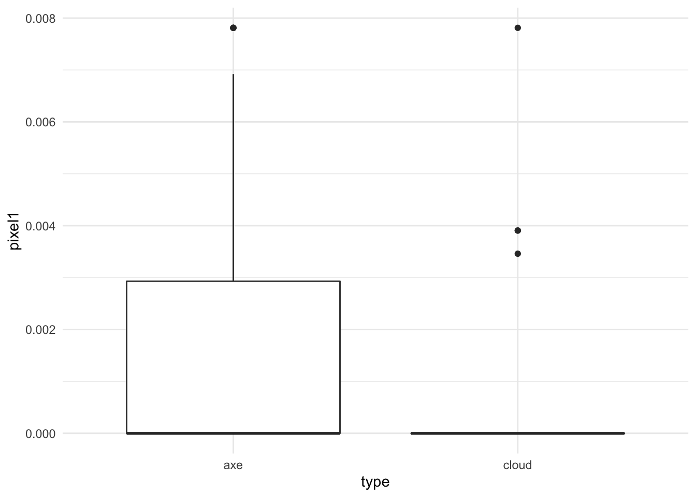

```r
ggplot(train_dat,aes(x=type,y=pixel100)) + geom_boxplot() + theme_minimal()
```

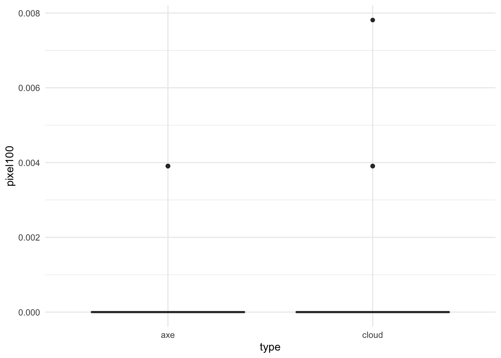

In general, this would kick off another phase of exploratory analysis before setting off to build a model. 

### Statistical prediction/modeling

Now that we have a sufficiently organized and cleaned data set we can go about modeling. This is the part that tends to get a lot of attention. Random forests, deep neural nets, and penalized regression, oh my! But the best data analyses use the simplest model that they can to get the job done. There are always tradeoffs - typically between some measure of accuracy and either cost, time, interpretability, or convenience. We will discuss these tradeoffs later in the class, but in general, it is better to err on the side of simplicity when developing a statistical model. 

For this simple example we will use penalized logistic regression. In particular, we use the lasso penalty - which encourages a model that uses as few of the pixels as possible when predicting. 


```r
myGrid <- expand.grid(
                       alpha = 1,
                       lambda = seq(0.0001, 1, length = 20)
                      )

mod = train(as.factor(type) ~ . - drawing , data=train_dat,
            method="glmnet",
            tuneGrid = myGrid)

confusionMatrix(as.factor(test_dat$type),predict(mod,test_dat))
```

```
## Confusion Matrix and Statistics
## 
##           Reference
## Prediction axe cloud
##      axe    43     7
##      cloud   7    43
##                                           
##                Accuracy : 0.86            
##                  95% CI : (0.7763, 0.9213)
##     No Information Rate : 0.5             
##     P-Value [Acc > NIR] : 4.142e-14       
##                                           
##                   Kappa : 0.72            
##                                           
##  Mcnemar's Test P-Value : 1               
##                                           
##             Sensitivity : 0.86            
##             Specificity : 0.86            
##          Pos Pred Value : 0.86            
##          Neg Pred Value : 0.86            
##              Prevalence : 0.50            
##          Detection Rate : 0.43            
##    Detection Prevalence : 0.50            
##       Balanced Accuracy : 0.86            
##                                           
##        'Positive' Class : axe             
## 
```

It looks like we get a reasonable level of accuracy compared to our original question - we were shooting for 80% accuracy, and for low levels of the regularization parameter we are above 80%: 


```r
plot(mod)
```


### Interpret results

Next we might dig in deeper and try to understand why and how our model is working. For example we might look at the pixels with non-zero coefficients. 


```r
library(pheatmap)
coef(mod$finalModel, mod$bestTune$lambda)[-1] %>%
        abs() %>%
        matrix(byrow=TRUE,nrow=16) %>%
        pheatmap(.,cluster_cols=FALSE,cluster_rows=FALSE)      
```

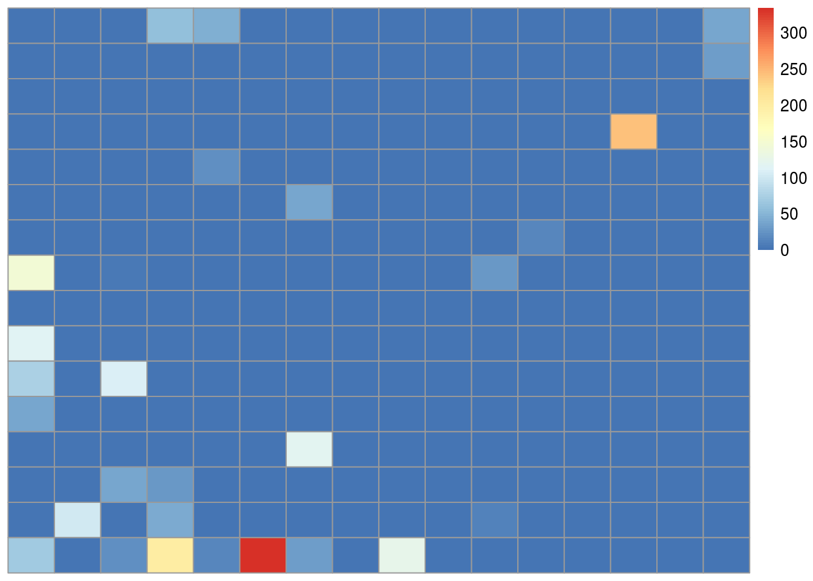

We see that most of the non-zero coefficients are clustered near the bottom of the image. If you look at the pictures of axes and clouds above, you'll see that the lower part of the image often contains the handle of the axe. So one interpretation might be that the handle of the axe may be the feature our model is using to make the predictions. In a real data analysis we would want to explore and evaluate that carefully. 

### Challenge results

On the one hand we have completed a "successful" data analysis - we have identified a model that answers our original, specific data science question up to our originally proposed metric for success. But there are also a number of outstanding questions like: 

- Would this work if we had to classify many types of images?
- Would this level of accuracy hold up in the real world? 
- Did our approach to downsampling produce bias? Reduce accuracy? 
- Is our sample size sufficiently large to have confidence in our answer?
- Does this analysis even really address our more general question of creating a classifier for a hardware website?

Some of these questions are easy to answer, some less so. But a critical component of any data analysis is identifying these issues and including them in the analysis you ultimately deliver. 

### Synthesize/write up results

We have gone through a simple analysis of images from Google QuickDraw. This represents what we would call a "raw" analysis of the data. A raw analysis is performed as a stream of consciousness, trying out each idea as you go without discarding or attempting to synthesize. 

If this were a real data science project, the next step would be synthesis and interpretation. We will discuss the keys to a successful data analysis later in the course. But a primary purpose of an analysis is to communicate the answer to the question. 

So our write-up might include an executive summary of our conclusions, remove extraneous and unnecessary processing, include additional explanations for a non-technical audience, clean up figures, and provide a clearer "arc" to the analysis. We might recommend next steps for both analysis and implementation and highlight key strengths or weaknesses of our approach. 

### Create reproducible code

The most common query from a collaborator, manager, or executive when you perform an analysis is:

> Could you just re-run that code with the [latest/different/best] parameters?

Even if you are doing a data science project solely for yourself you should keep in mind that: 

> Your closest collaborator is you six months ago, but you don’t reply to emails

Both of these quotes are modified from this excellent lecture by [Karl Broman](http://kbroman.org/Tools4RR/assets/lectures/06_org_eda.pdf) as part of his [Tools for Reproducible Research Course](https://kbroman.org/Tools4RR/). 

The point of these quotes is that it is an almost certainty that you will need to run your analysis more than once. For that reason alone, it is worth it to build out code that can be used to perform the analysis automatically - saving your future self hours of frustrating investigation. 


## Raw, informal, and formal data science

In this lecture we have performed a "raw" data analysis. We did not attempt to organize, synthesize, or format our analysis for a particular audience. Every step, piece of code, and plot inthe analysis was included whether it was relevant or not. 

Raw data analysis is almost always the place to start. As with the parable of the blind men and the elephant, the priority should be placed on a full exploration to identify all of the strengths and weaknesses of both the data and the methods used on the data. 

An "informal" data analysis takes the first steps toward polishing a data analysis for a broader audience. Common steps between a raw data analysis and an informal data analysis are:

- An arc of the analysis will be defined
- Unimportant analyses may be removed
- Figures may be improved
- Code may be removed or simplified
- Conclusions will be more specifically outlined 


But the analysis might not be subject to the formal structure of a memo, report, or journal article. Some examples of informal data analyses are:

* http://varianceexplained.org/r/trump-tweets/
* https://hilaryparker.com/2013/01/30/hilary-the-most-poisoned-baby-name-in-us-history/
* http://alyssafrazee.com/2014/06/04/gender-and-github-code.html

A formal data analysis is one that may appear in a formalized report, memo, or journal. Some steps for moving from an informal to a formal data analysis are:

- An arc of the analysis will be streamlined
- Unimportant analyses will be removed 
- Supporting analyses will be moved to supporting documentation
- Figures may be production quality
- Code will be moved to supporting documentation
- Methods will be referenced and supported
- Conclusions will be referenced and supported 

Moreover, the analysis will conform to a specific set of formatting rules, structure, and style that are specific to the outlet.

Each of these types of data science can play an important role in scoping projects and moving them forward - depending on the relative need for speed or completeness. 


## Additional Resources

:::resources
* [Art of Data Science](https://leanpub.com/artofdatascience)
* [Tools for Reproducible Research](https://kbroman.org/Tools4RR/)
* [Opinion: Reproducible research can still be wrong: Adopting a prevention approach](https://bit.ly/3lYAeLS)
* [10 simple rules for structuring papers](https://journals.plos.org/ploscompbiol/article?id=10.1371/journal.pcbi.1005619)
:::


## Homework 

:::homework
* __Template Repo__: https://github.com/advdatasci/homework2
* __Repo Name__: homework2-ind-yourgithubusername
* __Pull Date__: 2020/09/14 9:00AM Baltimore Time 
:::
