--- 
pagetitle: "Week 5 - Skepticism, discovery and critiquing data analyses"
---

# Week 5

## Week 5 Learning Objectives

:::keyidea
At the end of this lesson you will be able to: 

* Appropriately understand and weight skepticism and discovery and data science
* Identify and fix key problems with data analytic figures 
* Identify common data analytic mistakes and their characteristics
* Identify common over-skepticism pitfalls and think carefully about the skepticism/discovery tradeoff
:::


## Skepticism vs. Discovery

> The first principle is that you must not fool yourself – and you are the easiest person to fool.
> - Richard Feynman 

Statisticians often think of themselves as referees - we have the habit of standing just outside of a scientific field and poking holes in the choices that the analysts or scientists made when analyzing their data. This isn't entirely bad, as skepticism is a key component of performing thoughtful data analysis. 

But being a data scientist or doing data science involves a more delicate tradeoff. You have both be searching for new discoveries and simultaneously skeptical of what you find. Getting to the right place in the discovery vs. skepticism balance will depend somewhat on the role you are playing - statisticians at the FDA should be more skeptical, while data scientists at new startups made need to focus on discovery. However, all working data scientists should both be aware of the tradeoff and think carefully about where they want to be in terms of balance. 

If you tilt too far toward skepticism, you will inevitably not be involved in the biggest and most exciting discoveries we can make with data. But if you strive entirely for discovery you will almost certainly fool yourself and others. Perhaps the greatest complement you can pay to a data scientist is that they are thoughtful about the way they consider a data set. 

This has actually been a huge challenge for the field of statistics - which has traditionally heavily weighted skepticism. In many of the early (and ongoing!) data science initiatives you won't find many statisticians. This is both bad for data science and bad for statisticians. As Roger put it in his post [Statistics and the Science Club](https://simplystatistics.org/2012/06/22/statistics-and-the-science-club/) (from way back in 2012!):

>[Data Science] presents an enormous opportunity for statisticians to play a new leadership role in scientific investigations because we have the skills to extract information from the data that no one else has (at least for the moment). But now we have to choose between being "in the club" by leading the science or remaining outside the club to be unbiased arbiters. I think as an individual it’s very difficult to be both simply because there are only 24 hours in the day. It takes an enormous amount of time to learn the scientific background required to lead scientific investigations and this is piled on top of whatever statistical training you receive.
>
> However, I think as a field, we desperately need to promote both kinds of people, if only because we are the best people for the job. We need to expand the tent of statistics and include people who are using their statistical training to lead the new science. They may not be publishing papers in the Annals of Statistics or in JASA, but they are statisticians. If we do not move more in this direction, we risk missing out on one of the most exciting developments of our lifetime.

Fortunately since Roger wrote this statistics as a field has slowly become more supportive of data science and open to different weights on skepticism vs. discovery. But it still is an important tradeoff that each field must consider. As Rafa Irizarry [put it](https://simplystatistics.org/2013/08/01/the-roc-curves-of-science/#:~:text=ROC%20curves%20plot%20true%20positive,for%20a%20given%20classifying%20procedure.&text=The%20current%20state%20of%20biomedical,rarely%20comment%20on%20the%20TPR):

> Few will deny that our current system, with all its flaws, still produces important discoveries. Many of the pessimists’ proposals for reducing false positives seem to be, in one way or another, a call for being more conservative in reporting findings. Example of recommendations include that we require larger effect sizes or smaller p-values, that we correct for the “researcher degrees of freedom”, and that we use Bayesian analyses with pessimistic priors. I tend to agree with many of these recommendations but I have yet to see a specific proposal on exactly how conservative we should be. Note that we could easily bring the false positives all the way down to 0 by simply taking this recommendation to its extreme and stop publishing biomedical research results all together. 


He goes on to produce this hypothetical ROC curve for the scientific enterprise. An ROC curve plots the rate of true discoveries on the y-axis (in this case, hypothetical true discoveries per decade) versus the number of false discoveries (in this case, hypothetical false discoveries per decade). He highlights two fields - physics and biology. Physics as a more mature, and possibly more well understood field, makes many discoveries even with a strict cutoff for false discoveries. Biomedical sciences is much less well understood and so offers the potential for more discoveries, however, if we are too strict with our approach we may miss many important discoveries in our effort to root out all potential false discoveries. 


This week we will focus on how to identify potential issues with a data analysis - while we do this we should be aware that though these techniques of skepticism are important, we should also be careful to not over apply them lest we miss the opportunity to find important discoveries. 

## Figures


We will cover the creation of figures for papers in a separate lecture. But there are a few principles to consider when evaluating a figure in a data analysis. Many of these ideas are borrowed from [Karl Broman](https://www.biostat.wisc.edu/~kbroman/presentations/graphs_MDPhD2014.pdf). There are a variety of reasons to create statistical graphics, infographics, and data visualizations. They depend on the audience and community. However, for data analyses intended to support a scientific claim, there are a few common categories of issues  you should look out for. 

### Just modeling results -> show the data!

In many data analytic reports you will find a series of tables and regression modeling results, but no graphical displays of the data whatsoever. It is well known that regression models can obscure important data characteristics. One of the earliest example is Anscombe's quartet - a set of four data sets that have exactly identical regression coefficients, statistics, and inference, but have wildly different behavior.


A more hilarious recent version is the [Datasaurus dozen](https://www.autodeskresearch.com/publications/samestats), a set of twelve data sets that all have identical regression summaries (same mean in x, same mean in y, same correlation, same standard deviation, etc)


If an analysis produces only statistical summaries and no visualizations of the data, then you should be skeptical that something could be going on "under the hood". Similarly, when performing your own data analyses you should be sure to show the data. 

### Dynamite plots -> scatterplots 

Another very popular type of plot is the "dynamite plot" (shown on the left here in this [great paper on data visualization in biology](https://journals.plos.org/plosbiology/article?id=10.1371/journal.pbio.1002128)) 


Dynamite plots are very popular in molecular biology but often appear in other forums as well. As you can see though, the reporting of just a mean and variance can obscure wildly different data distributions. Be wary of dynamite plots in published analyses, especially with small sample sizes. In your own analyses you can use [beeswarm plots](https://github.com/eclarke/ggbeeswarm) or [boxplots with points overlayed](https://www.r-graph-gallery.com/89-box-and-scatter-plot-with-ggplot2.html).


### Ridiculograms -> clustering diagrams


[Ridiculograms](https://www.youtube.com/watch?v=YS-asmU3p_4) have been defined as

> Visually stunning, scientifically worthless, and published on the cover of Science or Nature 

These graphs take the form of a tangled hairball network diagram like these. 


It is often better to show more of the data and create clustering diagrams as an alternative to ridiculograms as described [in this paper](https://europepmc.org/article/pmc/pmc5333167#CR16). 


A good package for creating nicely labeled heatmaps in R is the [pheatmap](https://davetang.org/muse/2018/05/15/making-a-heatmap-in-r-with-the-pheatmap-package/) package. 


### Venn diagrams -> upset plots


Venn diagrams are often used in data analyses to represent intersections between groups. However, if the number of intersections starts to grow even in a bit you can end up with some fairly difficult to read and often borderline silly graphs like this. 


An alternative approach for complicated intersections that is often much easier to read (and less likely to end up bananas) is the UpSet plot which you can make with the unhelpfully capitalized [UpSetR](https://cran.r-project.org/web/packages/UpSetR/index.html) package. 


These plots represent the most common intersections and also can be used to illustrate both marginal and conditional relationships. 

### Extreme variation in scales -> log scales

For many types of measurement devices, data can be measured on a very broad range of scales. Here is an example from two microarrays measuring the same 20,000 genes on two different samples from [Karl Broman's lecture](https://www.biostat.wisc.edu/~kbroman/presentations/graphs2018.pdf). 

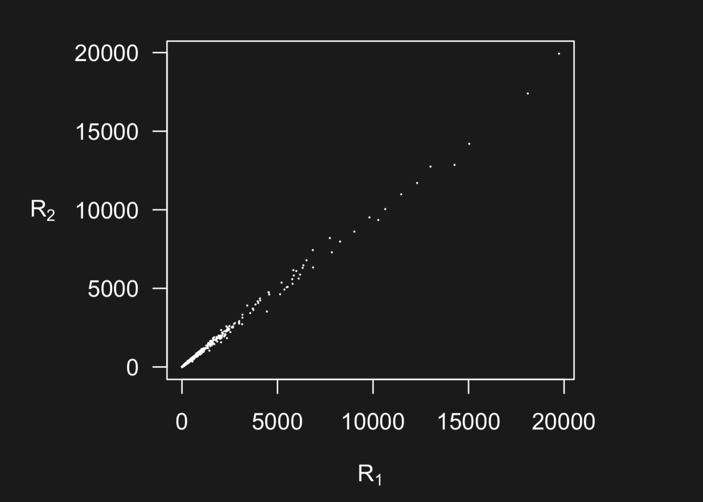

But what you can't see in this plot is the data is highly concentrated at smaller scales - with 50 percent of the data below the pink line and 99 percent  of the data below the blue line. 

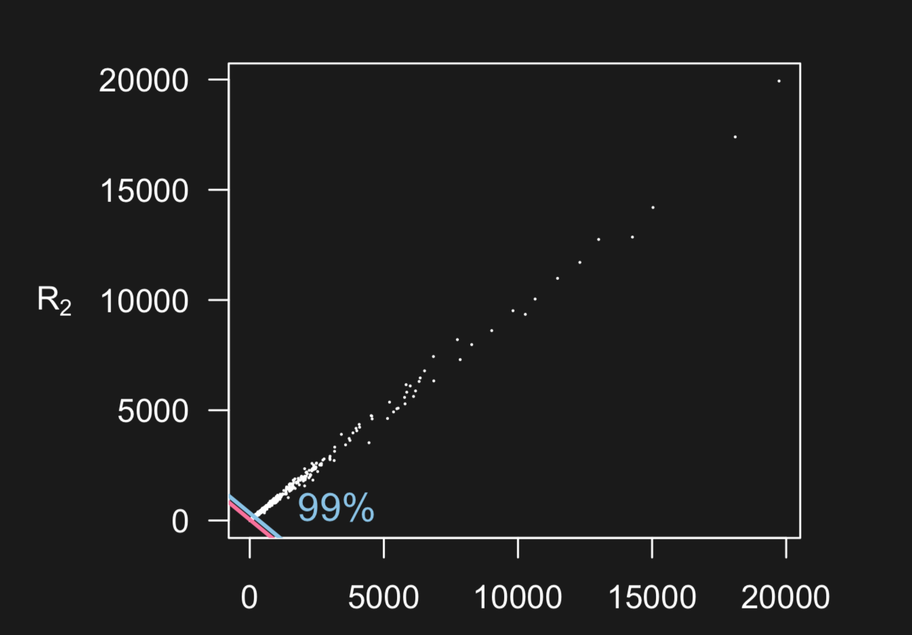

When you see plots like this that span a very large range with possible outliers, you might dig in deeper to see if a lot of the variation in the data is being obscured by the larger measurements. One solution is to plot the data on the log scale - so the data are more visible. 

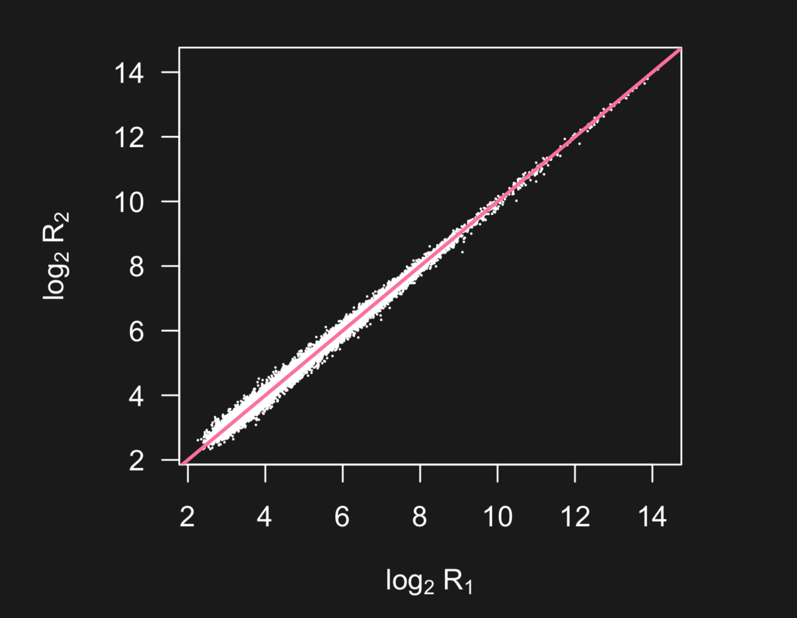

### Correlated measurements -> MA plots

It is very common when comparing two measurements of the same thing to plot the measurements on the x and y axis and measure the correlation. But this can be deceiving, especially if the measurements are on very different scales. When you see comparisons of measurements in an x-y scatterplot, you should ask yourself what is the difference between those measurements. An alternative way to show that comparison (using the same example as above) is to plot the difference between the values on the y-axis and the sum of the values on the x-axis. This plot has been discovered multiple times, so is called different things in differnet fields. In medicine it is a [Bland-Altman plot](https://en.wikipedia.org/wiki/Bland%E2%80%93Altman_plot) and in genomics it is an [MA-plot](https://en.wikipedia.org/wiki/MA_plot#:~:text=An%20MA%20plot%20is%20an,scales%2C%20then%20plotting%20these%20values.) among other names. 

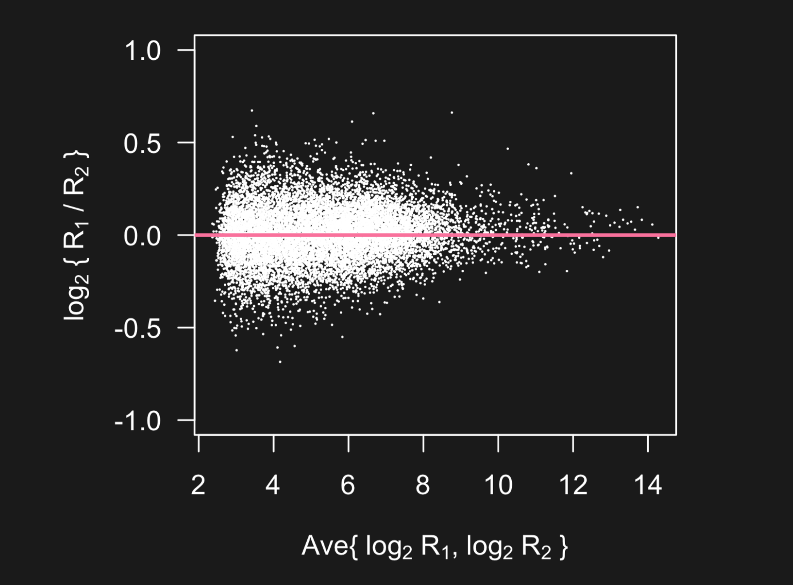

### Axes cutoff -> plot to zero

When reading barplots, it is important to check the y-axis. Often a plot can seem to show big differences - for example the plot on the right. 


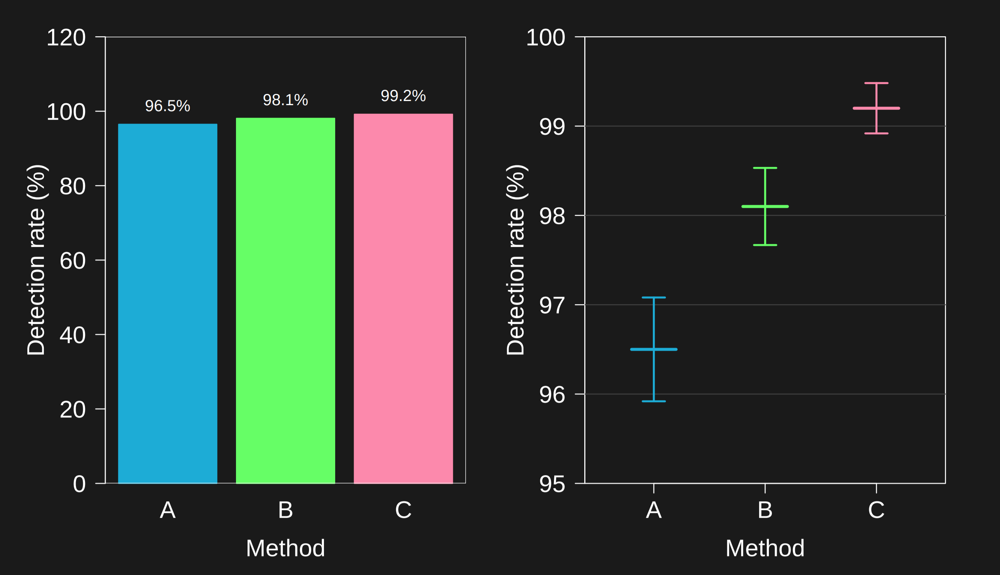

However, when you set the axis all the way to zero it may be clear that the numbers are only separated by a small amount. This is one of the most commonly used techniques for [deceiving with graphs](https://www.businessinsider.com/fox-news-charts-tricks-data-2012-11). But both ways can be appropriate - it depends on what difference actually matters. The main thing here is to check the y-axis and in your own plots, to point out if you don't start the axis at zero prominently.  

### 3d graphics -> just don't 

3-D graphs are common in some charting software. They distract, [they make comparisons harder](https://www.data-to-viz.com/caveat/3d.html). If you see them, you should be skeptical about what is being hidden. In your own practice, just don't. 


### Pie charts -> adjacent bar plots

The statistician Bill Cleveland did a [famous experiment](http://www.jstor.org/stable/2288400
) where he showed people two types of graphs - pie charts and line charts. 

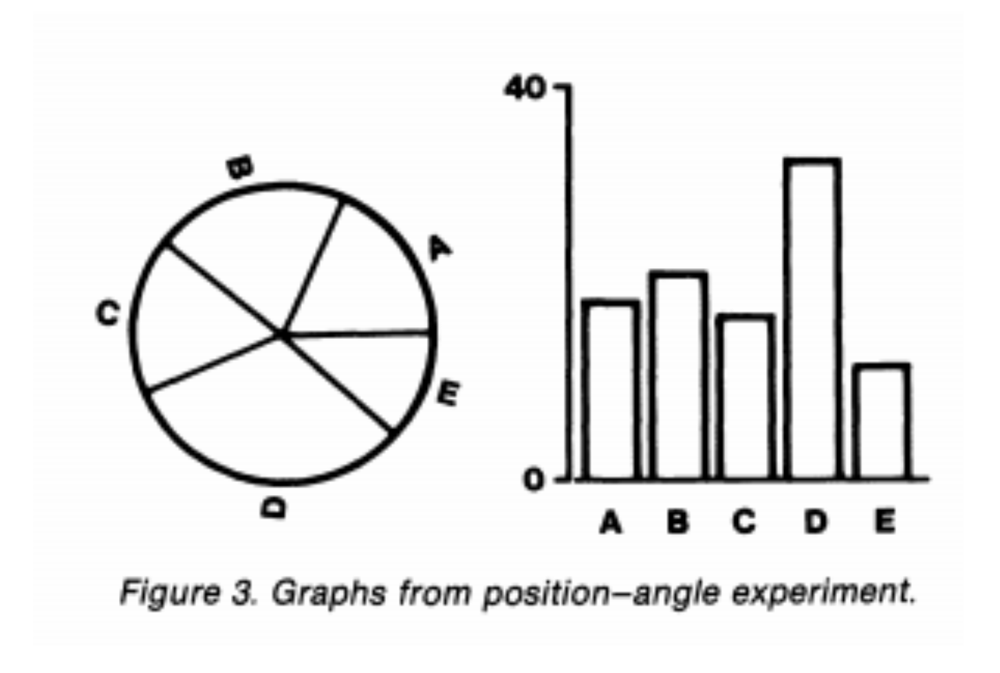

Then he asked them to estimate the size of the dotted portion of the graph. People had much lower error when juding length in side-by-side barplots than in pie charts. 


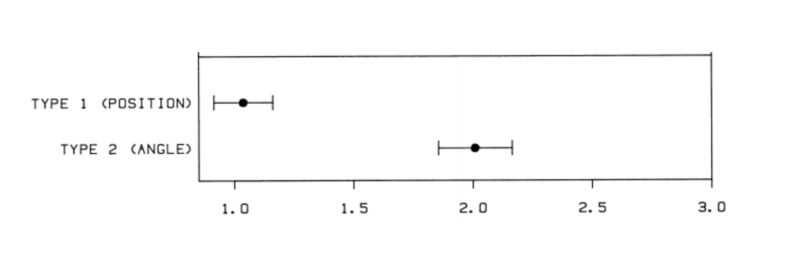

This experiment is why statisticians don't like pie charts! If you see one, especially with many slices - you might want to look for the data in tabular form. If you are doing the analysis yourself put the data in bars. 


### Difficult comparisons -> put things close on linear axes

From Karl's lecture consider comparing the blue element to the pink element. Which case is easiest? 

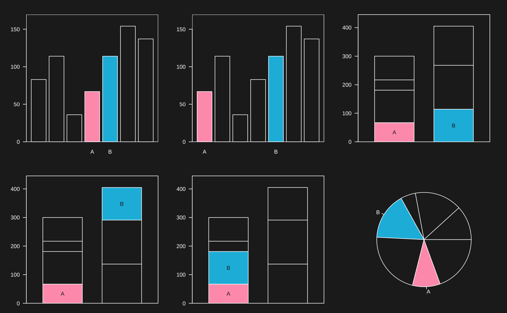

 If you see a very complicated comparison asking you to compare small slices of two separate pie charts, be skeptical that you will be able to make that comparison well. In general putting things on a linear scale and close together when making a comparison makes it easier for the reader.


### Comparisons hard to make between plots -> use common axes

If you see a comparison between two plots in different panels, it is important to check to make sure the axes are on the same scale as it can be really deceiving if they aren't. 


```r
library(tidyverse)
library(patchwork)
dat = tibble(x=rnorm(100,mean=2),y=rnorm(100,mean=25))

p1 = dat %>%
        ggplot(aes(y=x)) + geom_boxplot() + theme_minimal()
p2 = dat %>%
        ggplot(aes(y=y)) + geom_boxplot() + theme_minimal()

pcombined = p1 + p2
pcombined
```

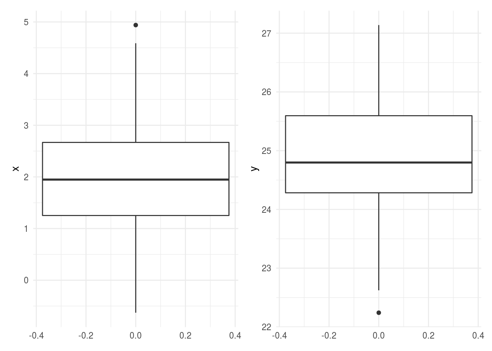

In general if you see comparisons like this where the axes aren't on the same scale, you might be concerned that the author doesn't realize the measurements aren't compararable. In your own analysis, you will want to make sure comparisons across plots have aligned axes and axes on the same scale. 


```r
pcombined & ylim(-1,28) 
```

```
## Warning: Removed 1 rows containing non-finite values (stat_boxplot).
```

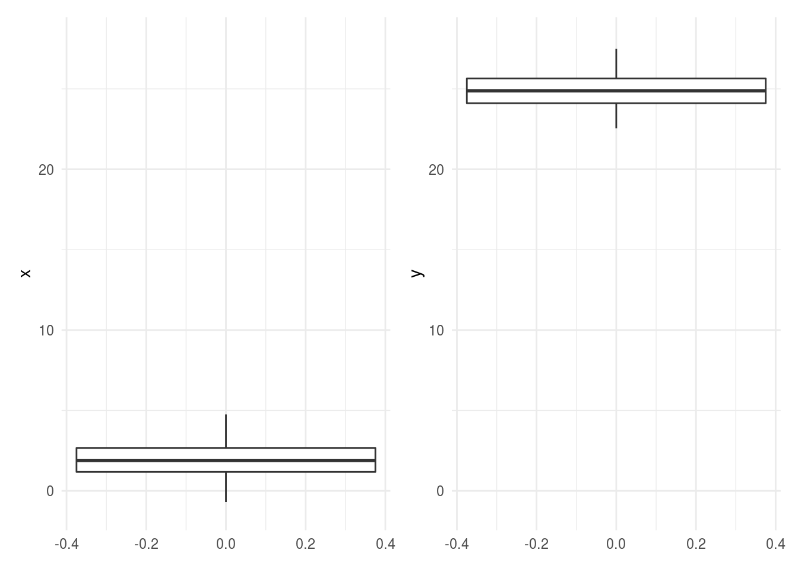


### Legends hard to follow -> use labels

Legends in graphs often make you do two steps at once: (1) figure out what a color or size means and (2) make the comparison between levels of that color or size. For example on the left the color is labeled in a legend. You have to glance up to the legend, then back to the graph to follow what is going on. It is much easier if the labels appear directly on the graph. 

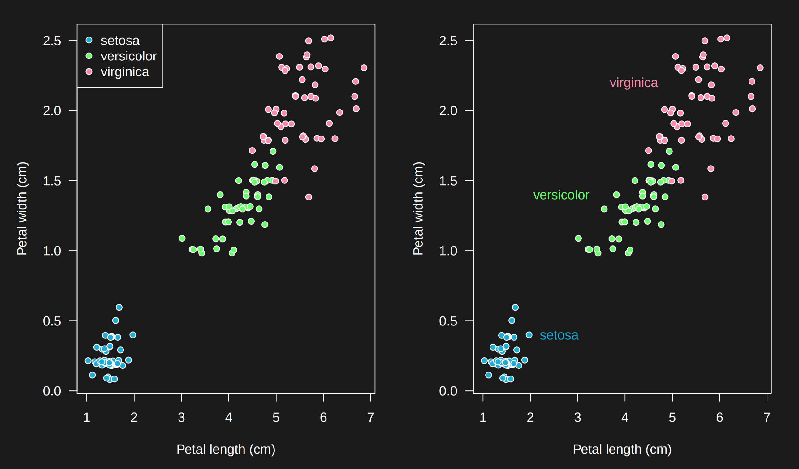


This is not to say that legends on graphs are bad! But moving toward labels encourages simplicity in the labels and reduces cognitive overhead on the reader. 

### Confounders aren't clear -> color by confounder 

When you are looking at a scatterplot in a paper for a primary comparison or correlation where important confounders have been discussed - always look for a graph where the points have been colored by the values of the confounder. For example here is a plot of the top two principal components of a gene expression data set from [Rafa Irizarry's genomics book](http://genomicsclass.github.io/book/). 


The PCs have been colored by the year the samples were processed. You can see that there is a clear relationship between the PCs and the date the samples were processed - making it an important potential confounder! 


## Common data analytic fallacies 

_This section based on the [fantastic lecture](https://jhu-advdatasci.github.io/2019/lectures/07-being-skeptical.html) by Stephanie Hicks and derived from material in Rafa Irizarry's [data science book](https://rafalab.github.io/dsbook/) - this section is licensed [CC BY-NC-SA 4.0](https://creativecommons.org/licenses/by-nc-sa/4.0/) based on Rafa's license._


As we learned last week, Skepticism is one of the key principles of data
analysis. Perhaps the best known piece of skepticism we teach to statistics students is that: 
> "Correlation is not causation"

In our course we will consider tools useful for 
quantifying associations between variables. However, 
we must be careful not to overinterpret these associations. 

There are many reasons that a variable $X$ can be 
correlated with a variable $Y$ without either being a 
cause for the other. Here we examine three common ways 
that can lead to misinterpreting data.

1. Spurious correlation
2. Outliers
3. Reversing cause and effect
4. Confounders

Next, we will discuss in detail what each of these are
and give an example.

### Spurious correlation

First we load some packages we will use


```r
library(tidyverse)
library(broom) # installed, but not loaded with library(tidyverse)
library(dslabs) # needs to be installed 
library(HistData) # needs to be installed 
```


The following comical example underscores that correlation 
is not causation. It shows a very strong correlation between 
divorce rates and margarine consumption. 


```r
the_title <- paste("Correlation =", 
      round(with(divorce_margarine, 
      cor(margarine_consumption_per_capita, divorce_rate_maine)),2))
data(divorce_margarine)
divorce_margarine %>% 
  ggplot(aes(margarine_consumption_per_capita, 
             divorce_rate_maine)) + 
  geom_point(cex=3) + 
  geom_smooth(method = "lm") + 
  ggtitle(the_title) +
  xlab("Margarine Consumption per Capita (lbs)") + 
  ylab("Divorce rate in Maine (per 1000)")
```

```
## `geom_smooth()` using formula 'y ~ x'
```

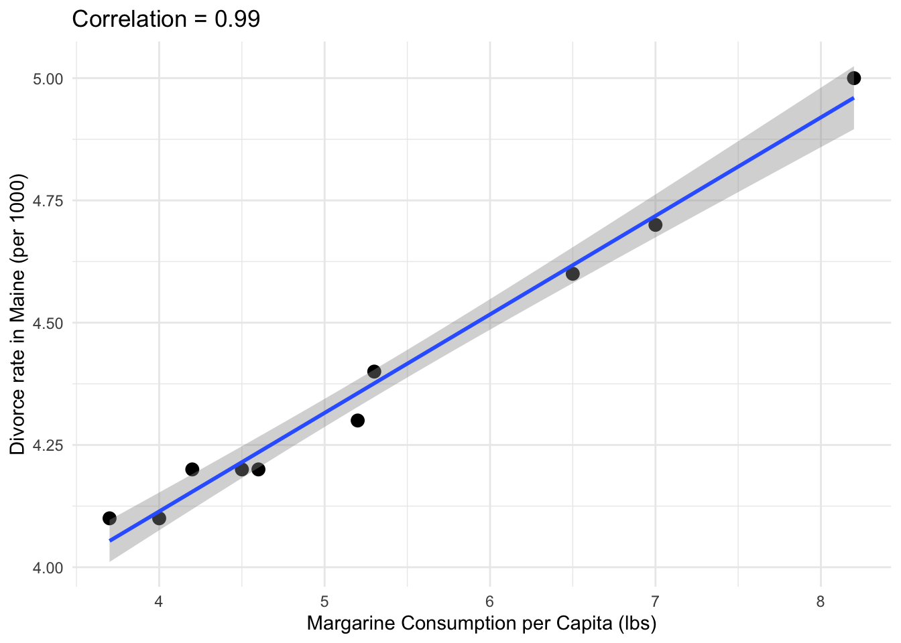

Does this mean that margarine causes divorces? Or do
divorces cause people to eat more margarine? Of course
the answer to both these questions is no. This is just 
an example of what we call a _spurious correlation_.

You can see many more absurd examples of 
[this wesbsite](http://tylervigen.com/spurious-correlations) 
completely dedicated to _spurious correlations_. 

The cases presented in the _spurious correlation_ site 
are all examples of what is generally called _data dredging_,
_data fishing_, or _data snooping_. It's basically a form 
of what in the US they call _cherry picking_. An example 
of data dredging would be if you look through many results 
produced by a random process and pick the one that shows 
a relationship that supports a theory you want to defend.

A Monte Carlo simulation can be used to show how data 
dredging can result in finding high correlations 
among uncorrelated variables. We will save the results
of our simulation into a tibble:


```r
N <- 25
G <- 10000
set.seed(1000)
sim_data <- tibble(group = rep(1:G, each = N),
                   X = rnorm(N*G), Y = rnorm(N*G))
sim_data
```

```
## # A tibble: 250,000 x 3
##    group       X       Y
##    <int>   <dbl>   <dbl>
##  1     1 -0.446  -0.312 
##  2     1 -1.21    0.0613
##  3     1  0.0411  1.17  
##  4     1  0.639  -1.32  
##  5     1 -0.787   1.89  
##  6     1 -0.385  -1.04  
##  7     1 -0.476   0.446 
##  8     1  0.720   0.396 
##  9     1 -0.0185  0.864 
## 10     1 -1.37    1.10  
## # … with 249,990 more rows
```

The first columns denotes group and we simulated 
 of 
groups each with 25 observations. For each group we
generate 25 observations, which are stored in the 
second and third columns. These are just random independent 
normally distributed data. So we know, because we 
constructed the simulation, that $X$ and $Y$ are not correlated.

Next, we compute the correlation between `X` and `Y` 
for each group and look at the max:


```r
res <- sim_data %>% 
  group_by(group) %>% 
  dplyr::summarize(r = cor(X, Y)) %>% 
  arrange(desc(r))
```

```
## `summarise()` ungrouping output (override with `.groups` argument)
```

```r
res
```

```
## # A tibble: 10,000 x 2
##    group     r
##    <int> <dbl>
##  1  2519 0.641
##  2  7746 0.620
##  3  5914 0.598
##  4  5516 0.589
##  5  3488 0.582
##  6  7531 0.581
##  7  2549 0.581
##  8  1362 0.573
##  9  7072 0.573
## 10  7544 0.571
## # … with 9,990 more rows
```

We see a correlation of 0.641 and if
you just plot the data from that group it shows a 
convincing plot that $X$ and $Y$ are in fact correlated:


```r
sim_data %>% 
  filter(group == res$group[which.max(res$r)]) %>%
  ggplot(aes(X, Y)) +
  geom_point() + 
  geom_smooth(method = "lm")
```

```
## `geom_smooth()` using formula 'y ~ x'
```

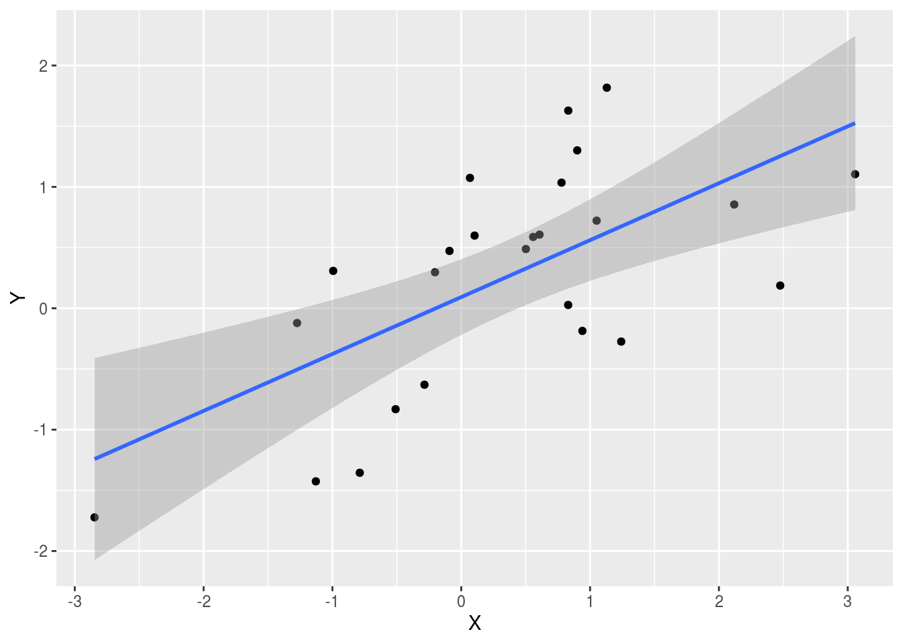

Remember that the correlation summary is a random variable.
Here is the distribution generated by the Monte Carlo 
simulation:


```r
res %>% 
  ggplot(aes(x=r)) + 
  geom_histogram(binwidth = 0.1, color = "black")
```

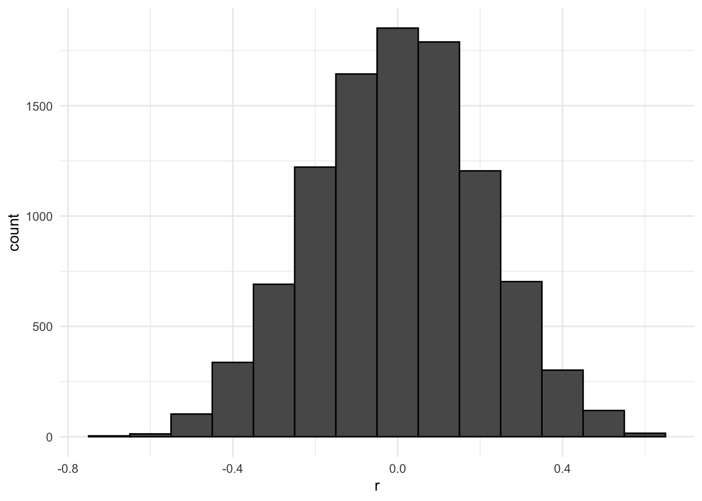

It is just a mathematical fact that if we observe 
10000 random correlations that are expected to
be 0 but have a standard error of 
0.204, the largest one will be
close 1. 

**Note**: If we performed regression on this group and 
interpreted the p-value, we would incorrectly claim this 
was a statistically significant relation:


```r
sim_data %>% 
  filter(group == res$group[which.max(res$r)]) %>%
  do(tidy(lm(Y ~ X, data = .)))
```

```
## # A tibble: 2 x 5
##   term        estimate std.error statistic  p.value
##   <chr>          <dbl>     <dbl>     <dbl>    <dbl>
## 1 (Intercept)   0.0923     0.151     0.613 0.546   
## 2 X             0.469      0.117     4.01  0.000548
```

This particular form of data dredging is referred to
as _p-hacking_. P-hacking is a topic of much discussion 
because it is a problem in scientific publications. 

Because publishers tend to reward statistically significant 
results over negative results, there is an incentive to
report significant results. In epidemiology and the social
sciences, for example, researchers may look for associations
between an adverse outcome and several exposures and report
only the one exposure that resulted in a small p-value. 
Furthermore, they might try fitting several different models
to adjust for confounding and pick the one that yields 
the smallest p-value. In experimental disciplines, an 
experiment might be repeated more than once, yet only the
results of the one experiment with a small p-value reported.

This does not necessarily happen due to unethical behavior,
but rather to statistical ignorance or wishful thinking. In
advanced statistics courses you learn methods to adjust 
for these multiple comparisons.


### Outliers


Suppose we take measurements from two independent outcomes,
$X$ and $Y$, and we standardize the measurements. However, 
imagine we make a mistake and forget to standardize 
entry 23. We can simulate such data using:


```r
set.seed(1)
x <- rnorm(100,100,1)
y <- rnorm(100,84,1)
x[-23] <- scale(x[-23])
y[-23] <- scale(y[-23])
```

The data look like this:

```r
tibble(x,y) %>%
  ggplot(aes(x,y)) + 
  geom_point(alpha = 0.5)
```

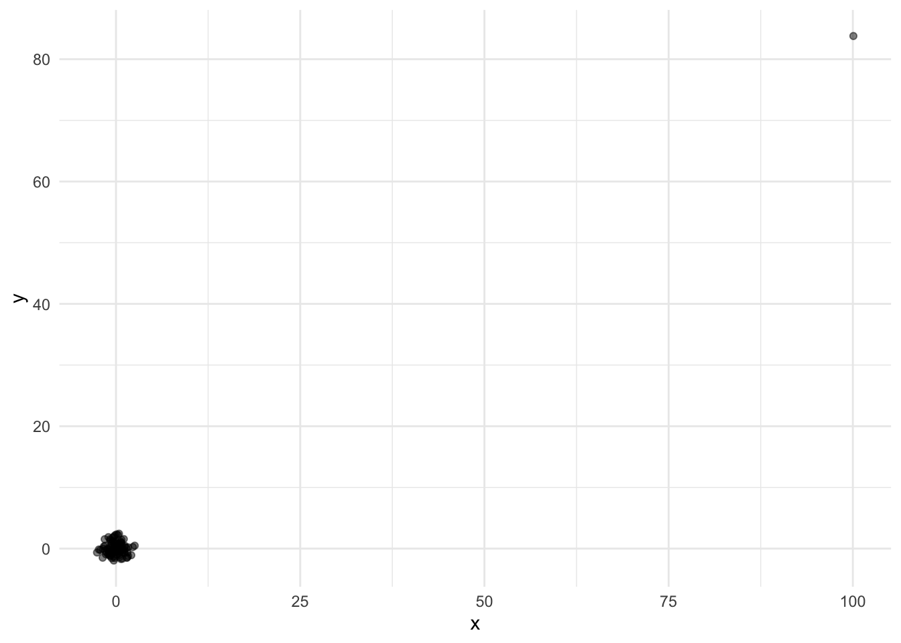

Not surprisingly, the correlation is very high:


```r
cor(x,y)
```

```
## [1] 0.9881391
```

But this is driven by the one outlier. If we remove 
this outlier, the correlation is greatly reduced 
to almost 0, what it should be:


```r
cor(x[-23], y[-23])
```

```
## [1] -0.001066464
```

There is an alternative to the sample correlation for
estimating the population correlation that is robust 
to outliers. It is called _Spearman correlation_.

The idea is simple: compute the correlation on the ranks
of the values. Here is a plot of the ranks plotted 
against each other:


```r
tibble(x,y) %>% 
  ggplot(aes(rank(x),rank(y))) + 
  geom_point(alpha = 0.5)
```

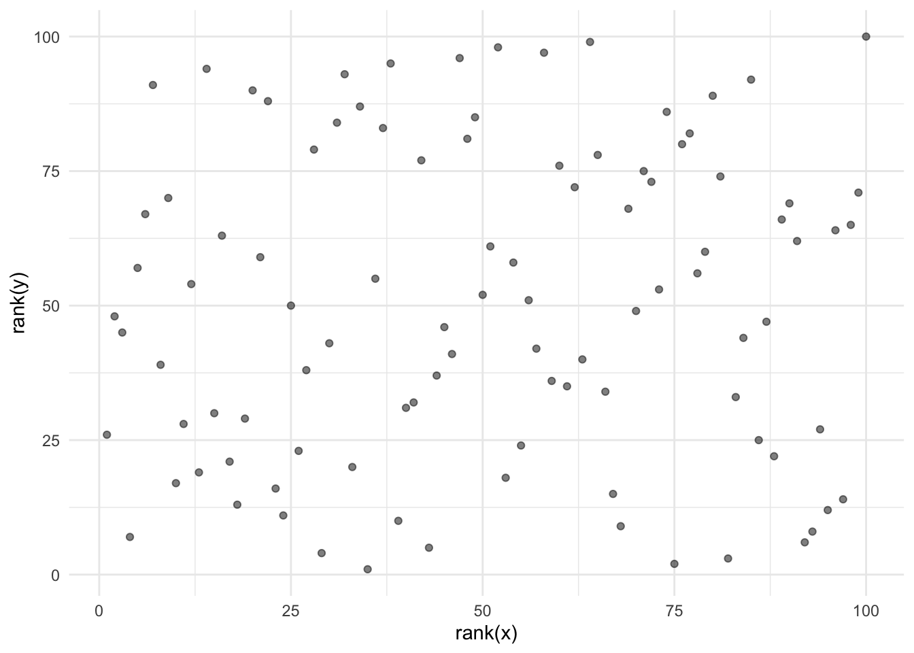

The outlier is no longer associated with a very 
large value and the correlation comes way down:


```r
cor(rank(x), rank(y))
```

```
## [1] 0.06583858
```

Spearman correlation can also be calculated like this:


```r
cor(x, y, method = "spearman")
```

```
## [1] 0.06583858
```

There are also methods for robust fitting of linear models
which you can learn about in, for instance, this book:

Robust Statistics: Edition 2
Peter J. Huber Elvezio M. Ronchetti 

### Reversing Cause and Effect


Another way association is confused with causation is when 
the cause and effect are reversed. An example of this is
claiming that tutoring makes students perform worse because
they test lower than peers that are not tutored. In this
case, the tutoring is not causing the low test scores, 
but the other way around.  

A form of this claim was actually made it into an op-ed
in the New York Times titled 
[Parental Involvement Is Overrated](https://opinionator.blogs.nytimes.com/2014/04/12/parental-involvement-is-overrated/?rref=opinion&module=ArrowsNav&contentCollection=Opinion&action=keypress&region=FixedLeft&pgtype=Blogs). 

Consider this quote from the article:

> When we examined whether regular help with homework had a positive impact on children’s academic performance, we were quite startled by what we found. Regardless of a family’s social class, racial or ethnic background, or a child’s grade level, consistent homework help almost never improved test scores or grades... Even more surprising to us was that when parents regularly helped with homework, kids usually performed worse.
A very likely possibility is that the children needing 
regular parental help, receive this help because 
they don't perform well in school.

We can easily construct an example of cause and
effect reversal using the father and son height
data. If we fit the model:

$$X_i = \beta_0 + \beta_1 y_i + \varepsilon_i, i=1, \dots, N$$

to the father and son height data, with $X_i$ the 
father height and $y_i$ the son height, we do get a 
statistically significant result:


```r
library(HistData)
data("GaltonFamilies")
GaltonFamilies %>%
  filter(childNum == 1 & gender == "male") %>%
  select(father, childHeight) %>%
  rename(son = childHeight) %>% 
  do(tidy(lm(father ~ son, data = .)))
```

```
## # A tibble: 2 x 5
##   term        estimate std.error statistic  p.value
##   <chr>          <dbl>     <dbl>     <dbl>    <dbl>
## 1 (Intercept)   34.0      4.57        7.44 4.31e-12
## 2 son            0.499    0.0648      7.70 9.47e-13
```

The model fits the data very well. If we look at the 
mathematical formulation of the model above, it could 
easily be incorrectly interpreted as to suggest that
the son being tall caused the father to be tall. But 
given what we know about genetics and biology, we 
know it's the other way around. The model is technically
correct. The estimates and p-values were obtained 
correctly as well. What is wrong here is the interpretation.


### Confounders

Confounders are perhaps the most common reason that 
leads to associations being misinterpreted.  

If $X$ and $Y$ are correlated, we call $Z$ a _confounder_
if changes in $Z$ cause changes in both $X$ and $Y$. 

Incorrect interpretation due to confounders is 
ubiquitous in the lay press. It is sometimes hard
to detect. Here we present two examples, both 
related to gender discrimination.

#### Case Study: UC Berkeley admissions 

Admission data from six U.C. Berkeley majors, from 1973,
showed that more men were being admitted than women: 
44% men were admitted compared to 30% women. PJ Bickel,
EA Hammel, and JW O'Connell. Science (1975). 

Here are the data:


```r
data(admissions)
admissions
```

```
##    major gender admitted applicants
## 1      A    men       62        825
## 2      B    men       63        560
## 3      C    men       37        325
## 4      D    men       33        417
## 5      E    men       28        191
## 6      F    men        6        373
## 7      A  women       82        108
## 8      B  women       68         25
## 9      C  women       34        593
## 10     D  women       35        375
## 11     E  women       24        393
## 12     F  women        7        341
```

We see the percent of men and women that
were accepted was:


```r
admissions %>% 
  group_by(gender) %>% 
  summarize(percentage =
            round(sum(admitted*applicants)/sum(applicants),1))
```

```
## `summarise()` ungrouping output (override with `.groups` argument)
```

```
## # A tibble: 2 x 2
##   gender percentage
##   <chr>       <dbl>
## 1 men          44.5
## 2 women        30.3
```

A statistical test clearly rejects the hypothesis 
that gender and admission are independent:


```r
dat <- admissions %>% 
  group_by(gender) %>% 
  summarize(total_admitted = round(sum((admitted/100)*applicants)), 
            not_admitted = sum(applicants) - sum(total_admitted)) %>%
  select(-gender) 
```

```
## `summarise()` ungrouping output (override with `.groups` argument)
```

```r
dat %>% 
  do(tidy(chisq.test(.)))
```

```
## # A tibble: 1 x 4
##   statistic  p.value parameter method                                           
##       <dbl>    <dbl>     <int> <chr>                                            
## 1      91.6 1.06e-21         1 Pearson's Chi-squared test with Yates' continuit…
```

But closer inspection shows a paradoxical result. Here
are the percent admissions by major:


```r
admissions %>% 
  select(major, gender, admitted) %>%
  spread(gender, admitted) %>%
  mutate(women_minus_men = women - men)
```

```
##   major men women women_minus_men
## 1     A  62    82              20
## 2     B  63    68               5
## 3     C  37    34              -3
## 4     D  33    35               2
## 5     E  28    24              -4
## 6     F   6     7               1
```

Four out of the six majors favor women. More importantly
all the differences are much smaller than the 14.2 
difference that we see when examining the totals.

The paradox is that analyzing the totals suggests a 
dependence between admission and gender, but when the 
data is grouped by major, this dependence seems to 
disappear. 

What's going on? This actually can happen if an
uncounted confounder is driving most of the 
variability.

So let's define three variables: 

* $X=1$ for men and $X=0$ for women
* $Y=1$ for those admitted and $Y=0$ otherwise
* $Z$ quantifies how selective is the major

A gender bias claim would be based on the fact that
$\mbox{Pr}(Y=1 | X = x)$ is higher for $X=1$ then 
$X=0$. But $Z$ is an important confounder to consider. 
Clearly $Z$ is associated with  $Y$, as the more 
selective a major, the lower $\mbox{Pr}(Y=1 | Z = z)$.

But is major selectivity $Z$ associated with gender $X$?

One way to see this is to plot the total percent 
admitted to a major versus the percent of women 
that made up the applicants:

```r
admissions %>% 
  group_by(major) %>% 
  summarize(major_selectivity = sum(admitted*applicants)/sum(applicants),
            percent_women_applicants = sum(applicants*(gender=="women")/sum(applicants))*100) %>%
  ggplot(aes(major_selectivity, percent_women_applicants, label = major)) +
  geom_text()
```

```
## `summarise()` ungrouping output (override with `.groups` argument)
```

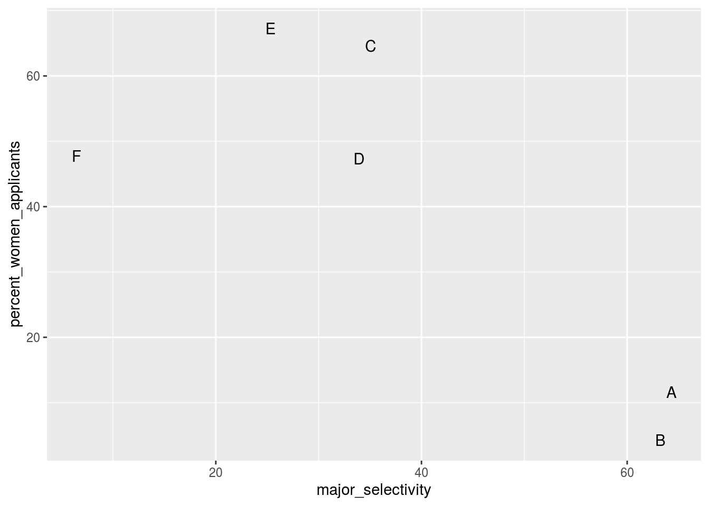

There seems to be an association. The plot suggests that 
women were much more likely to apply to the two "hard" majors:
gender and major's selectivity are confounded. Compare, for 
example, major B and major E. Major E is much harder to 
enter than major B and over 60% of applicants to major E 
were women while less than 10% of the applicants of major
B were women. 


#### Confounding explained graphically

The following plot shows the percent of applicants that were
accepted by gender.


```r
admissions %>% 
  mutate(percent_admitted = admitted*applicants/sum(applicants)) %>%
  ggplot(aes(gender, y = percent_admitted, fill = major)) +
  geom_bar(stat = "identity", position = "stack")
```

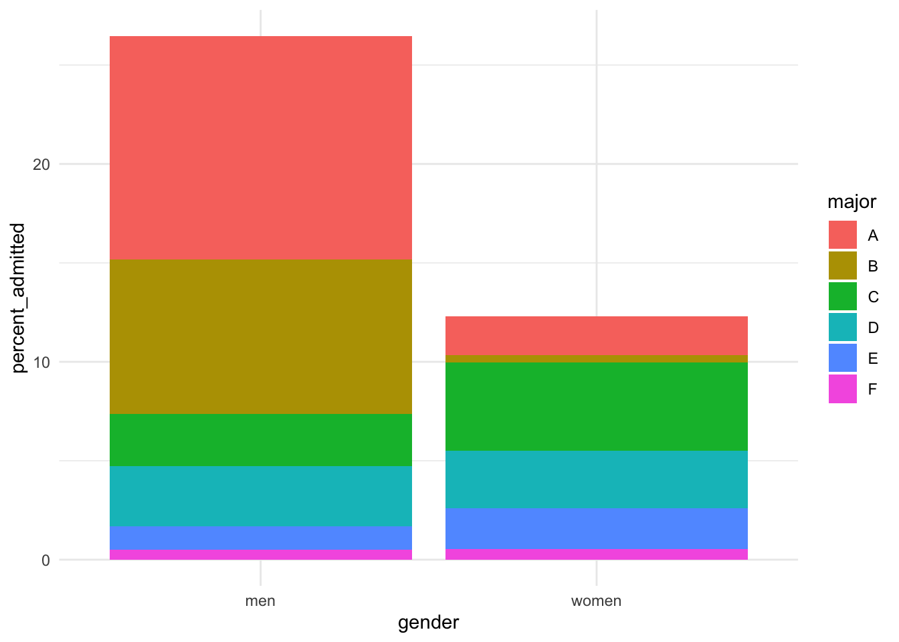

It also breaks down the acceptance rates by major: the size 
of the colored bars represents the percent of each major 
students were admitted to. This breakdown allows us to 
see that the majority of accepted men come from two majors:
A and B. It also lets us see that few women were accepted 
to these majors. 

What the plot does **not** show us is 
the number of applicants for each major. 

#### Average after stratifying

In this plot, we can see that if we condition or stratify 
by major, and then look at differences, we control for 
the confounder and this effect goes away. 


```r
admissions %>% 
  ggplot(aes(major, admitted, col = gender, 
             size = applicants)) +
  geom_point() + xlab("Major") + 
  ylab("Admission percentage by major for each gender")
```

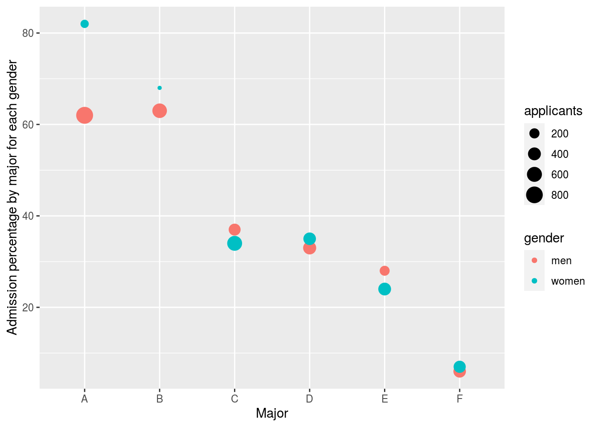

Now we see that major by major, there is not
much difference. The size of the dot represents 
the number of applicants, and explains the 
paradox: we see large red dots and small blue 
dots for the easiest majors, A and B.

If we average the difference by major we find that the 
percent is actually 3.5% higher for women.


```r
admissions %>% 
  group_by(gender) %>% 
  summarize(average = mean(admitted))
```

```
## `summarise()` ungrouping output (override with `.groups` argument)
```

```
## # A tibble: 2 x 2
##   gender average
##   <chr>    <dbl>
## 1 men       38.2
## 2 women     41.7
```

### Simpson's Paradox 

The case we have just covered is an example of Simpson's 
Paradox. It is called a paradox because we see the 
sign of the correlation of flip when comparing the 
entire dataset and specific strata. The following 
is an illustrative example. Suppose you have three 
variables $X$, $Y$ and $Z$. Here is a scatterplot of
$Y$ versus $X$:


```r
N <- 100
Sigma <- matrix(c(1,0.75,0.75, 1), 2, 2)*1.5
means <- list(c(11,3), c(9,5), c(7,7), c(5,9), c(3,11))
dat <- lapply(means, function(mu) 
  MASS::mvrnorm(N, mu, Sigma))
dat <- Reduce(rbind, dat)
colnames(dat) <- c("X", "Y")
dat <- tbl_df(dat) %>% 
  mutate(Z = as.character(rep(seq_along(means), each = N)))
```

```
## Warning: `tbl_df()` is deprecated as of dplyr 1.0.0.
## Please use `tibble::as_tibble()` instead.
## This warning is displayed once every 8 hours.
## Call `lifecycle::last_warnings()` to see where this warning was generated.
```

```r
dat %>% ggplot(aes(X,Y)) + geom_point(alpha = .5) +
  ggtitle(paste("correlation = ", round(cor(dat$X, dat$Y), 2)))
```

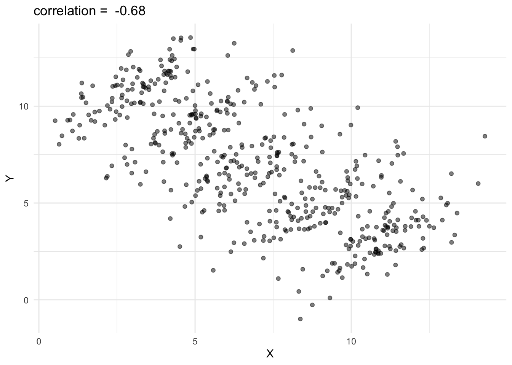

You can see that $X$ and $Y$ are negatively correlated.
However, once we stratify by $Z$, shown in different 
colors below, another pattern emerges. 


```r
means <- as_tibble(Reduce(rbind, means)) %>% 
  rename(x = V1, y = V2) %>% 
  mutate(z = as.character(seq_along(means)))
```

```
## Warning: The `x` argument of `as_tibble.matrix()` must have unique column names if `.name_repair` is omitted as of tibble 2.0.0.
## Using compatibility `.name_repair`.
## This warning is displayed once every 8 hours.
## Call `lifecycle::last_warnings()` to see where this warning was generated.
```

```r
corrs <- dat %>% 
  group_by(Z) %>% 
  summarize(cor = cor(X,Y)) %>%
  pull(cor) 
```

```
## `summarise()` ungrouping output (override with `.groups` argument)
```

```r
dat %>% ggplot(aes(X, Y, color = Z)) + 
  geom_point(show.legend = FALSE, alpha = 0.5) +
  ggtitle(paste("correlations =", 
                paste(signif(corrs,2), collapse=" "))) +
  annotate("text", x = means$x, y = means$y, 
           label = paste("Z=", means$z), cex = 5)  
```

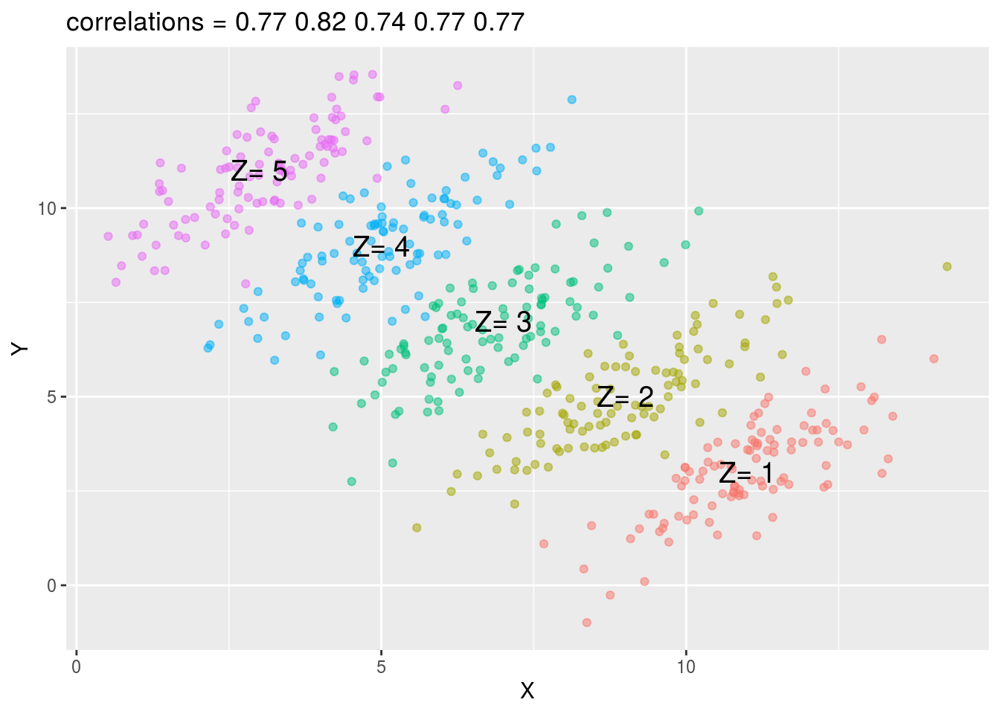

It is really $Z$ that is negatively correlated with $X$.
If we stratify by $Z$, the $X$ and $Y$ are actually 
positively correlated. 

#### Case Study: Research funding success

Here we examine a similar case to the UC Berkeley 
admissions example, but much more subtle.

A [2014 PNAS paper](http://www.pnas.org/content/112/40/12349.abstract) 
analyzed success rates from funding agencies 
in the Netherlands and concluded that their:

> results reveal gender bias favoring male applicants over female applicants in the prioritization of their "quality of researcher" (but not "quality of proposal") evaluations and success rates, as well as in the language used in instructional and evaluation materials.
or that gender contributes to personal research 
funding success in The Netherlands. 

The main evidence for this conclusion comes down 
to a comparison of the percentages. Table S1 in 
the paper includes the information we need:


```r
data("research_funding_rates")
research_funding_rates
```

```
##            discipline applications_total applications_men applications_women
## 1   Chemical sciences                122               83                 39
## 2   Physical sciences                174              135                 39
## 3             Physics                 76               67                  9
## 4          Humanities                396              230                166
## 5  Technical sciences                251              189                 62
## 6   Interdisciplinary                183              105                 78
## 7 Earth/life sciences                282              156                126
## 8     Social sciences                834              425                409
## 9    Medical sciences                505              245                260
##   awards_total awards_men awards_women success_rates_total success_rates_men
## 1           32         22           10                26.2              26.5
## 2           35         26            9                20.1              19.3
## 3           20         18            2                26.3              26.9
## 4           65         33           32                16.4              14.3
## 5           43         30           13                17.1              15.9
## 6           29         12           17                15.8              11.4
## 7           56         38           18                19.9              24.4
## 8          112         65           47                13.4              15.3
## 9           75         46           29                14.9              18.8
##   success_rates_women
## 1                25.6
## 2                23.1
## 3                22.2
## 4                19.3
## 5                21.0
## 6                21.8
## 7                14.3
## 8                11.5
## 9                11.2
```

We can construct the two-by-two table used for the conclusion above:


```r
two_by_two <- research_funding_rates %>% 
  select(-discipline) %>% 
  summarize_all(sum) %>%
  summarize(yes_men = awards_men, 
            no_men = applications_men - awards_men, 
            yes_women = awards_women, 
            no_women = applications_women - awards_women) %>%
  gather %>%
  separate(key, c("awarded", "gender")) %>%
  spread(gender, value)
two_by_two
```

```
##   awarded  men women
## 1      no 1345  1011
## 2     yes  290   177
```

Compute the difference in percentage:


```r
two_by_two %>% 
  mutate(men = round(men/sum(men)*100, 1),
         women = round(women/sum(women)*100, 1)) %>% 
  filter(awarded == "yes")
```

```
##   awarded  men women
## 1     yes 17.7  14.9
```

**Note**: It's lower for women, and find 
that it is almost statistically significant
at the $\alpha=0.05$ level:


```r
two_by_two %>% 
  select(-awarded) %>% 
  chisq.test() %>% 
  tidy
```

```
## # A tibble: 1 x 4
##   statistic p.value parameter method                                            
##       <dbl>   <dbl>     <int> <chr>                                             
## 1      3.81  0.0509         1 Pearson's Chi-squared test with Yates' continuity…
```

So there appears to be some evidence 
of an association. But can we infer causation
here? Is gender bias causing this observed
difference?

[A response](http://www.pnas.org/content/112/51/E7036.extract) 
was published a few months later titled _No evidence that gender contributes to personal research funding success in The Netherlands: A reaction to Van der Lee and Ellemers_  which concluded:

> However, the overall gender effect borders on statistical significance, despite the large sample. Moreover, their conclusion could be a prime example of Simpson’s paradox; if a higher percentage of women apply for grants in more competitive scientific disciplines (i.e., with low application success rates for both men and women), then an analysis across all disciplines could incorrectly show "evidence" of gender inequality.
In the UC Berkeley admissions example, the overall 
differences were explained by difference across 
disciplines. We use the same approach on the research 
funding data and look at comparisons by discipline:


```r
dat <- research_funding_rates %>% 
  rename(success_total = success_rates_total,
         success_men = success_rates_men,
         success_women = success_rates_women) %>%
  gather(key, value, -discipline) %>%
  separate(key, c("type", "gender")) %>%
  spread(type, value) %>%
  filter(gender != "total") %>%
  mutate(discipline = reorder(discipline, applications, sum))
dat %>% 
  ggplot(aes(discipline, success, size = applications, color = gender)) + 
  theme(axis.text.x = element_text(angle = 90, hjust = 1)) +
  geom_point()
```

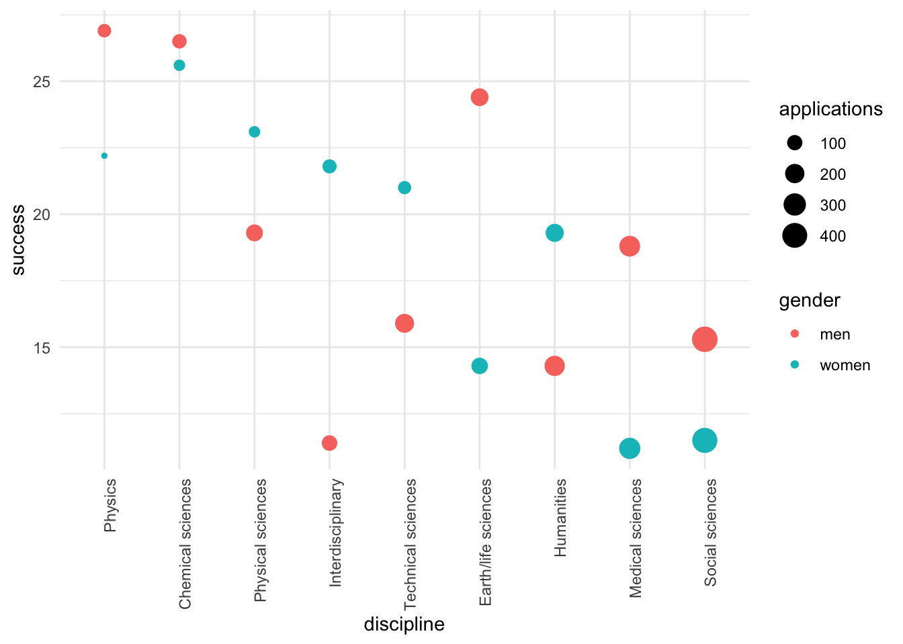

Here we see that some fields favor men and other women.
We see that the two fields with the largest difference
favoring men, are also the fields with the most applications.
However, are any of these differences statistically 
significant? 

Keep in mind that even when there is no bias,
we will see differences due to random variability in the
review process as well as random variability across candidates.
If we perform a Fisher test in each discipline, we see that 
most differences result in p-values larger than $\alpha = 0.05$.


```r
do_fisher_test <- function(m, x, n, y){
  tab <- tibble(men = c(x, m-x), women = c(y, n-y))
  tidy(fisher.test(tab)) %>% 
    rename(odds = estimate) %>%
    mutate(difference = y/n - x/m)
}
res <- research_funding_rates %>% 
  group_by(discipline) %>%
  do(do_fisher_test(.$applications_men, .$awards_men, 
                    .$applications_women, .$awards_women)) %>%
  ungroup() %>%
  select(discipline, difference, p.value) %>%
  arrange(difference)
res 
```

```
## # A tibble: 9 x 3
##   discipline          difference p.value
##   <chr>                    <dbl>   <dbl>
## 1 Earth/life sciences   -0.101    0.0367
## 2 Medical sciences      -0.0762   0.0175
## 3 Physics               -0.0464   1     
## 4 Social sciences       -0.0380   0.127 
## 5 Chemical sciences     -0.00865  1     
## 6 Physical sciences      0.0382   0.651 
## 7 Humanities             0.0493   0.217 
## 8 Technical sciences     0.0509   0.437 
## 9 Interdisciplinary      0.104    0.0671
```

We see that for Earth/Life Sciences, there is a difference
of 10% favoring men and this has a p-value of 0.04. But 
is this a spurious correlation? We performed 9 tests. 
Reporting only the one case with a p-value less than 
0.05 would be cherry picking. 

The overall average of the difference is only -0.3%, 
which is much smaller than the standard error:


```r
res %>% summarize(overall_avg = mean(difference), 
                  se = sd(difference)/sqrt(n()))
```

```
## # A tibble: 1 x 2
##   overall_avg     se
##         <dbl>  <dbl>
## 1    -0.00311 0.0226
```

Furthermore, note that the differences appear 
to follow a normal distribution:


```r
res %>% 
  ggplot(aes(sample = scale(difference))) + 
  stat_qq() + geom_abline()
```

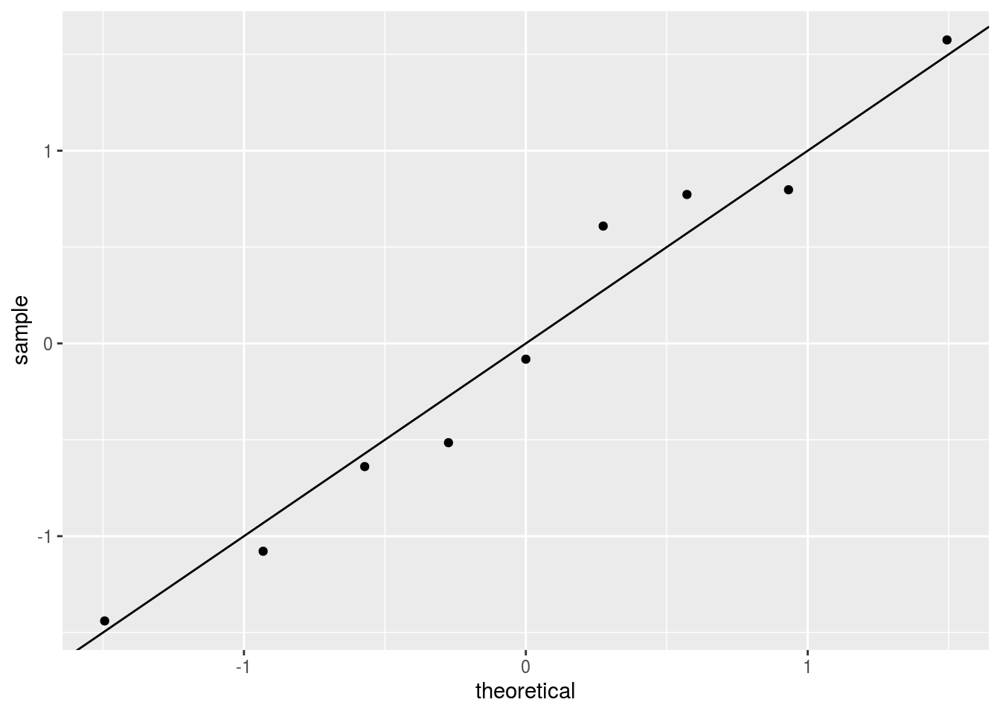

which suggests the possibility that the observed
differences are just due to chance. 

## Over-skepticism

There is a famous paper called [Why most published research findings are false](https://journals.plos.org/plosmedicine/article?id=10.1371/journal.pmed.0020124). There are also claims that [billions are wasted due to lack of reproducibility](https://journals.plos.org/plosbiology/article?id=10.1371/journal.pbio.1002165) and that [most psychological studies won't replicate](https://science.sciencemag.org/content/349/6251/aac4716). 

These represent very flashy and field defining examples of over skepticism. But there are more subtle forms that often come up when applying statistics within the context of statistics - where sometimes the role of referee is taken too far. 

### Everything must be causal

Recall from the types of questions that we might be interested in whether the manipulation of one variable causes a change in another variable. However, sometimes it is sufficiently interesting to simply see a correlation between variables. If an analysis is not over-interpreted, it is perfectly reasonable to present an association - sometimes the desire for causality will cause people to throw out interesting correlations. 

### Nothing can be causal

Causal inference as a subfield of statistics places extreme weight on skepticism versus discovery. This is often a very good thing. I want the FDA to be skeptical when they are evaluating what medicines I can take and if they might kill me! But there are also cases where observational data, carefully analyzed, can suggest causal relationships. This is tricky to do well in practice, but as a field there is a tendency to criticize any analysis attempting to discover causal relationshps unless is an idealized randomized trial - which hardly ever happens. 

### You should answer my question, not yours

When you read a data analysis there is a question the authors were trying to answer. Sometimes this corresponds to the question that you care about and sometimes it doesn't. A common tendency is to criticize a data analysis for not answering the question you wanted answered, even if it does a perfectly reasonable job of answering the question they set out to answer. 

### You used (insert method I don't use) therefore the analysis is wrong

Statistical modeling choices are made both for scientific and well-justified theoretical reasons; they are also made due to personal preference, ease of use, tradition in a field, and many other reasons. It is common to criticize analysts for using a different method than the one you would have used. Sometimes this is justified and the chosen method produces incorrect results, but often it is simply a personal preference and it makes more sense to understand the analysis in the context of the methdods used. 


## Additional Resources

:::resources

* [Karl Broman's Data Visualization Lecture](https://www.biostat.wisc.edu/~kbroman/presentations/graphs2018.pdf)
* [Rafa Irizarry's Data Science Book](https://rafalab.github.io/dsbook/)
* [Rafa Irizarry's Genomic Data Science Book](http://genomicsclass.github.io/book/)
* [Stephanie Hick's Lecture on Skepticism in Data Science](https://jhu-advdatasci.github.io/2019/lectures/07-being-skeptical.html)
:::


## Homework 

:::homework
* __Template Repo__: https://github.com/advdatasci/homework5
* __Repo Name__: homework5-ind-yourgithubusername
* __Pull Date__: 2020/10/05 9:00AM Baltimore Time 
:::
