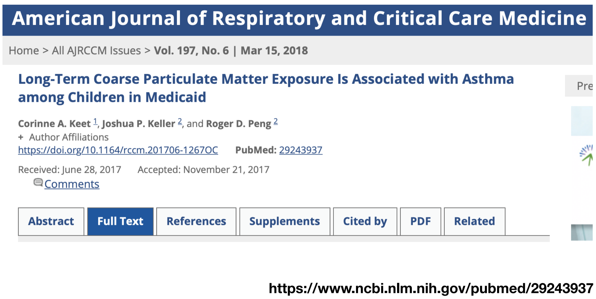
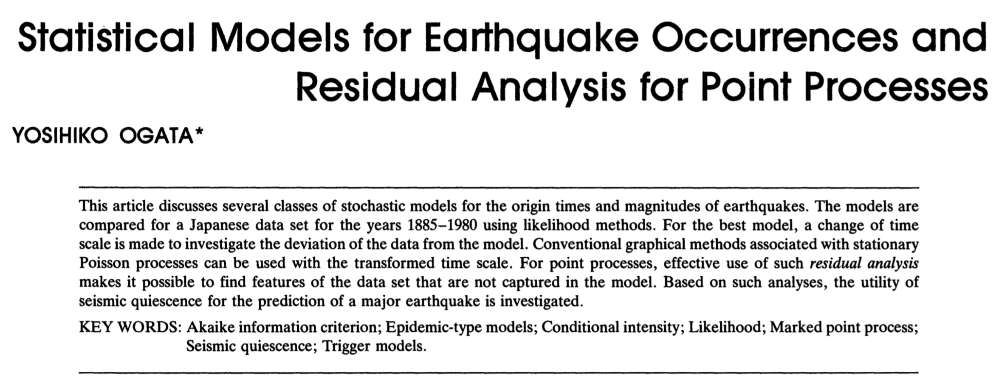
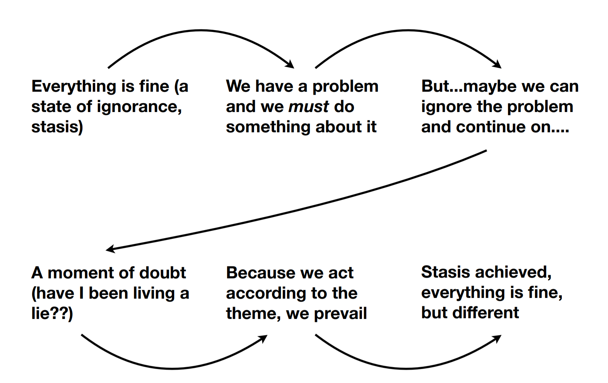
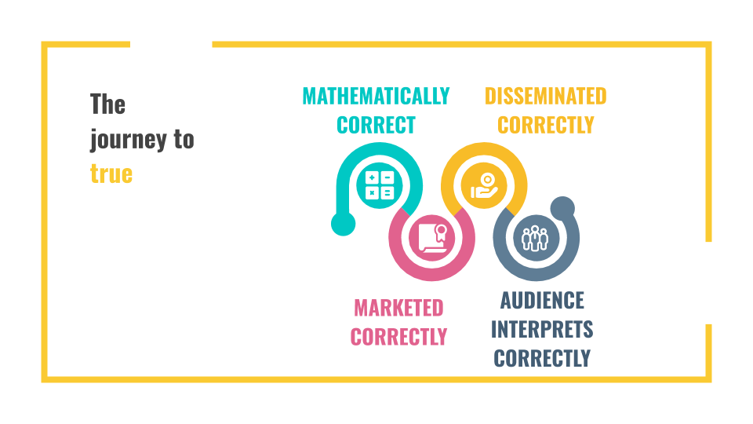
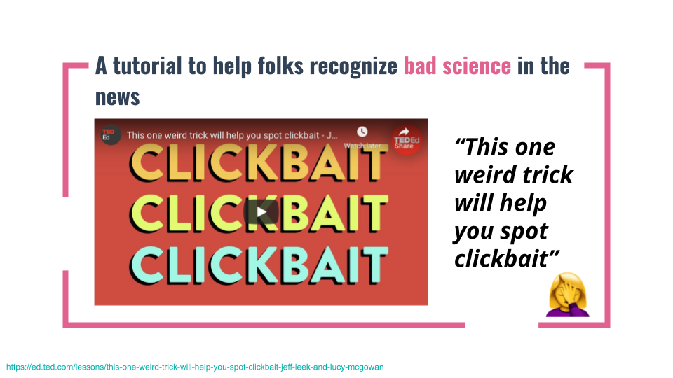
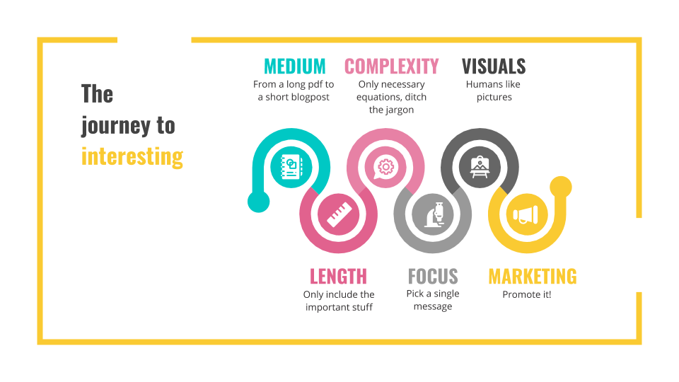
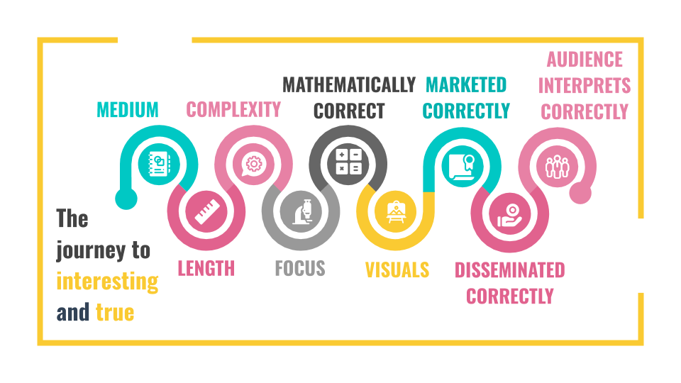
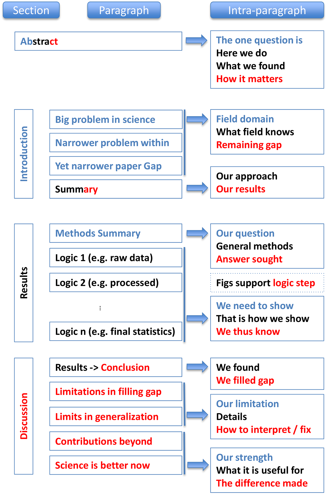

--- 
pagetitle: "Week 9 - Data analysis papers and telling stories with data"
---

# Week 9

## Week 9 Learning objectives

:::keyidea

At the end of this lesson you will be able to: 

* Understand the central dramatic argument, structure, and form of a data analysis
* Use "therefore" and "but" as linkers in your analysis instead of "and then"
* Be able to define the journeys to correct and interesting in a data analysis
* Know which parts of your analysis appear in each section of a data analytic paper

:::

## Story Telling in Data Analysis

As we have discussed earlier in the class, a data analysis always involves a communication between the analyst and their audience. A big part of that is telling the story of a data analysis. At the beginning of an analysis you will start out with a question and then through exploration you may chase dozens of leads and create hundreds of plots. But a key to success in data analysis is taking these disparate analyses and weaving them into a coherent story. 

### The Central Dramatic Argument 

The story or "arc" of a data analysis tells the central dramatic argument of the data and evidence. You can think of this a bit like "dimension reduction" for your analytic results. You are trying to summarize the key points and put them in order so that your audience doesn't have to follow all of the potential dead ends you may have chased when performing your analysis. 

Sometimes the dramatic argument is obvious - its right in the title like in this [paper](https://pubmed.ncbi.nlm.nih.gov/29243937/) by Roger and his colleagues. 

But it isn't always as clear what the central dramatic argument is in some papers. For example, this [paper](http://amstat.tandfonline.com/doi/abs/10.1080/01621459.1988.10478560)  

the central dramatic argument appears in the abstract:

> "For point processes, effective use of such residual analysis makes it possible to find features of the data set that are not captured in the model."

Depending on your writing style different approaches can be successful to creating a central dramatic arc. But it is critical to know that arc and follow it with your data analysis. 

It is also important to keep in mind that often we can agree on the data but disagree on what they tell us. Your job as the analyst, is to organize the evidence, present it clearly and help the audience to understand the arc through the data you are trying to present. 

### Thematic structure and causality

Most people who come to data analysis do so through a technical or empirical discipline like epidemiology or biostatistics. We have often have extensive and deep technical training but have spent less time learning about writing, exposition and telling stories. However, being good at writing can dramatically improve the impact of even your most technical writing. 

Since writing isn't often a component of technical curricula we need to look outside to find key ideas. In [Roger's lecture](https://jhu-advdatasci.github.io/2019/lectures/storytelling.pdf) he points to this great quote from the [Scriptnotes](https://johnaugust.com/scriptnotes) podcast:

> "The purpose of the story is to take a character
from ignorance of the truth of the theme to
embodiment of theme through action."  -Craig Mazin, Scriptnotes Podcast, Ep. 403

In that same episode they discuss the key thematic structure of a movie, which has some lessons for us as data analysts: 

The important thing about this structure is that there is a natural reason each step follows from the next and they flow from one to the other. A really nice simplification of this idea was proposed by the creators of the crass, but wildly successfull [South Park](https://en.wikipedia.org/wiki/South_Park) television series - Matt Stone and Trey Parker. They lay out their simple model for creating narrative in this [Youtube video](https://www.youtube.com/watch?v=vGUNqq3jVLg&feature=youtu.be&t=47) (a bit of strong language - no surprise)

They discuss how the narrative ideas in a story should be linked using the words "therefore" and "but". They also point out that stories where the narrative ideas are separated by "and then" are often much less coherent and harder to follow. The same rules apply in data analysis! When you are putting together the pieces of your analysis you should be thinking about causality between the beats of your story. 

For example this narrative structure takes the reader along with you on your path through the analysis: 

> "In our exploratory analysis we observed that height and weight were correlated,  _therefore_ we fit a linear model, _but_ after plotting the residuals and coloring by age of the participant we realized it was a confounder, _therefore_ we included it as an adjustment factor." 

However, a typical _"and then"_ analysis looks more like a catalog of things you tried without a coherent picture. 

> "We made a plot of height versus weight and then we made a plot of height versus age and then we fit a model that related height to weight adjusting for age." 

When writing your analysis, think carefully about how to construct the narrative so it flows naturally from step to step rather than feeling like a catalog.

### Format

The format of the presentation should match nature of the story being told. In some cases the format will be more formally structured, for example when reporting an analysis for a journal the structure may be dictated by the requirements of that journal. Other times, it may be more informal and free flowing. 

For example you may be reporting your analysis in a variety of formats:

* Blog post
* Report
* Paper
* Email 
* Interactive presentation

Each will have its own set of requirements. For blog posts it often makes sense to restrict the dramatic arc to a single, coherent thought process. An email may be only a few lines of writing with a single figure meant to convey just one point. More in depth interactive reporting like [The Follower Factory](https://www.nytimes.com/interactive/2018/01/27/technology/social-media-bots.html) may include interactive elements that guide the reader through the story. 

Below we will focus on the format for a data analytic scientific paper, but this format will depend heavily on the outlet you plan to ultimately pursue for communicating your results to your audience. 

### Trust and Belief

An audience can trust you did a good analysis, but still not believe your central dramatic argument. 

* Trust
        - I accept the analysis, the data were analyzed properly and
thoroughly
        - Trust is particular to the analysis and the person doing the
analysis
* Belief
        - I believe the conclusion / central argument, is true
        - Depends on context, previous work, factors outside the analysis

Regardless, the story you tell is part of a larger negotiation with the
audience to accept the analysis. Depending on your relationship to the audience you may need to alter the way that you tell your story. If you are well known in an area and have a track record of solid analyses - you may be able to streamline your reporting or move significant pieces of the analysis to supplementary documents. But if you are new to an audience, or working outside your standard field, you will need to be more careful about documenting your choices. 

In his piece on [trustworthy data analysis](https://simplystatistics.org/2018/06/04/trustworthy-data-analysis/) Roger discusses how there are three parts to a data analysis: 

* The parts you did and presented
* The parts you did but did not present
* The parts you did not do

As he puts it: 

> "As an analyst it might be useful to think of what are the things that will fall into components A, B, and C. In particular, how one thinks about the three components will likely depend on the audience to which the presentation is being made. In fact, the “presentation” may range from sending a simple email, to delivering a class lecture, or a keynote talk. The manner in which you present the results of an analysis is part of the analysis and will play a large role in determining the success of the analysis. If you are unfamiliar with the audience, or believe they are unfamiliar with you, you may need to place more elements in components A (the presentation), and perhaps talk a little faster. But if you already have a long-term relationship with the audience, a quick summary (with lots of things placed into component B) may be enough."

## The journey to interesting and true

In her outstanding [JSM 2020 talk](https://docs.google.com/presentation/d/1pZe8Sp350iYzsKsweZzR374179gvRwpI3cAX_NObgj8/edit#slide=id.g8ef8954ce3_0_673) Lucy D'Agostion McGowan makes a two by two table of the types of data analysis you can observe. On one axis is whether the analysis is interesting or not and on the other is whether it is true or not. 

Untrue and uninteresting analyses are not usually worth that much interest. The other three quandrants are worth discussing briefly. 

* __Interesting and true__ analyses are what we are typically trying to create as data analysts. They both tell a story people care about and they present the data fairly. 
* __Not interesting and true__ analyses are probably the most common, they occur when you present the data fairly, tell the best story you can, but there isn't a compelling story behind the data. These are ok! They should be reported more often than they are.
* __Interesting and untrue__ unfortunately these types of data analyses can be _very_ popular and have extremely negative consequences. They are the type of analysis you want to avoid at all costs. 

Lucy points out that there are two separate journeys we take when performing and communicating a data analysis. The first is the journey to true. 

This involves not only that the analysis is technically correct, but also that it is correctly disseminated, marketed, and interpreted by an audience. One important point to keep in mind is that you don't always control some of these steps! A great example is a Youtube video Lucy and I made for TedEd, trying to communicate how to avoid being misled by scientific headlines. When the video came out on Youtube they used the title, ["This one weird trick will help you spot Clickbait"](https://ed.ted.com/lessons/this-one-weird-trick-will-help-you-spot-clickbait-jeff-leek-and-lucy-mcgowan
) and had "Clickbait" written in gigantic font on the video: 

Needless to say, this approach to dissemination and marketing reduced the veracity of our argument and made it harder for people to believe what we were saying!

The journey to interesting is also a multi-step process which includes, picking the right format, length, complexity, focus, visuals, and marketing. These components depend on the forum, the audience you are communicating with, and the goal of your data analysis. 

When you put these ideas together you get the full journey to an interesting and true analysis: 

One reason that these analyses can be rare is that it really takes a lot of components working together to influence the results of an analysis. It is a lot to keep track of. But improving each of these components a bit has multiplicative effects on the success of your data analysis. 

## Data Analysis Papers

While there are a number of formats for producing data analyses and sharing them, in advanced data science our focus will be on producing data analytic papers. While this is a somewhat academic-flavored view of data analytic products, it is also extremely common to be asked to produce data analytic reports in industry and government, which will share many of the characteristics of good data analytic papers. 

### How do you know when to start writing?

Sometimes this is an easy question to answer. If you started with a very concrete question at the beginning then once you have done enough analysis to convince yourself that you have the answer to the question. If the answer to the question is interesting/surprising then it is time to stop and write. 

If the answer isn't interesting/surprising but you started with a concrete question it is also time to stop and write. But things often get more tricky with this type of paper as most journals when reviewing papers filter for "interest" so sometimes a paper without a really "big" result will be harder to publish. __This is ok!!__ Even though it may take longer to publish the paper, it is important to publish even results that aren't surprising/novel. It is much better that you come to an answer you are comfortable with and you go through a little pain trying to get it published than you keep pushing until you get an "interesting" result, which may or may not be justifiable (see the journey above). 

If you started with a question that wasn't so concrete then it gets a little trickier. The basic idea here is that you have convinced yourself you have a result that is worth reporting. Usually this takes the form of between 1 and 5 figures that show a coherent story that you could explain to someone in your field. We will talk more about publication quality figures next week. 

For the first paper you will probably get a lot of help from an advisor or mentor on when to stop. But in general one thing you should be working on in graduate school is your own internal timer that tells you, "ok we have done enough, time to write this up". I found this one of the hardest things to learn in graduate school, but it is a critical skill in both academics and industry. There are rarely deadlines for paper writing (unless you are submitting to CS conferences) so it will eventually be up to you when to start writing. If you don't have a good clock, this can really slow down your ability to get things published or complete projects at work and get promoted. 

One good principle to keep in mind is "the perfect is the enemy of the very good" Another one is that a published paper in a respectable journal beats a paper you just never submit because you want to get it into the "best" journal. David Robinson really accurately describes the importance of completing projects and putting them out: 

<blockquote class="twitter-tweet">
&quot;Things that are still on your computer are approximately useless.&quot; -<a href="https://twitter.com/drob?ref_src=twsrc%5Etfw">@drob</a> <a href="https://twitter.com/hashtag/eUSR?src=hash&amp;ref_src=twsrc%5Etfw">#eUSR</a> <a href="https://twitter.com/hashtag/eUSR2017?src=hash&amp;ref_src=twsrc%5Etfw">#eUSR2017</a> <a href="https://t.co/nS3IBiRHBn">pic.twitter.com/nS3IBiRHBn</a>
&mdash; Amelia McNamara (@AmeliaMN) <a href="https://twitter.com/AmeliaMN/status/926509282874585089?ref_src=twsrc%5Etfw">November 3, 2017</a></blockquote> 

### Structure 

A scientific paper can be distilled into four parts:

* A set of methodologies
* A description of data
* A set of results
* A set of claims

When you (or anyone else) writes a paper the goal is to communicate clearly items 1-3 so that they can justify the set of claims you are making. Before you can even write down 4 you have to do 1-3. So that is where you start when writing a paper.

This [paper](https://journals.plos.org/ploscompbiol/article?id=10.1371/journal.pcbi.1005619) in PLoS Computational Biology lays out some simple rules for writing papers - these rules apply across many fields, but are really useful to think about when writing data analytic papers. 

In particular I really like this visual structure of a data analytic paper: 

That helps to break down how each section works together. In the remainder of this lesson we will focus on some of the most important parts of a data analytic paper. These components should be included 

### Titles

Should be very short, declarative, and should state the main result. Example, "A new method for sequencing data that shows how to cure cancer". Here you want to make sure people will read the paper without overselling your results - this is a delicate balance. Unless you have a really good reason not to, the dramatic argument of your analysis should be the title. 

It is important to keep in mind that titles are *way more important* than you think; even if you think they are important. I read at most a couple of papers a week at this stage. But I read hundreds of paper titles. Only those that really hook me or are really important for my current research will get me to read further. 

### Abstracts

If I read hundreds of titles a week I might read a dozen paper abstracts. Depending on where you are submitting your paper abstracts may have pretty strict requirements and they vary quite a bit. For example consider the abstract structures at [JAMA](https://jamanetwork.com/journals/jama/pages/instructions-for-authors#SecAbstractsforReportsofOriginalData) versus something like [Nature](http://www.cbs.umn.edu/sites/default/files/public/downloads/Annotated_Nature_abstract.pdf) - they are very different!

I do think that the Nature structure provides a good general purpose approach to writing abstracts when a journal doesn't have concrete requirements. 

In particular: 

1. Lead with a widely accessible description of the area (this can be skipped for more specialized journal)
2. A sentence or two of background information about why the problem is important 3. A sentence or two describing the key question 
4. A sentence stating your key dramatic argument
5. A few sentences putting this result in context and providing broader perspective

Geting this much information into an abstract is a skill! It takes practice and is worth writing a much longer form of what you want to say and cutting it down. 

https://plos.org/resource/how-to-write-a-great-abstract/
http://www.cbs.umn.edu/sites/default/files/public/downloads/Annotated_Nature_abstract.pdf

### Introductions

An introduction should be a more lengthy (1-3 pages) explanation of the problem you are solving, why people should care, and how you are solving it. Always start with the big picture! Provide the audience with enough background that they understand _why_ you are tackling this problem and what others have done. 

Another important structural element is that abstracts should go from general to specific. So you should start by putting the idea in its general context, e.g. "cancer is important to study" and then narrow down to the problem you are addressing specifically, e.g. "measuring RNA abundance of genes helps us build biomarkers for cancer". 

Here you also review what other people have done in the area. The most critical thing is never underestimate how little people know or care about what you are working on. It is your job to explain to them why they should.

### Results

Results and methods may appear in either order, depending on the journal you are submitting to and the audience you are addressing. The key to a really solid results section is the combination of a coherent set of 1-5 figures that make up the "beats" of your analysis and then using the narrative connections of "therefore" and "but" to link these results together clearly. 

One of the "beats" may be a statistical model. It is good to try to condense your reported analysis to a small number of statistical models (one is ideal!) so that the reader doesn't have to keep up with which model you are fitting and how it has changed from analysis to analysis. If you must switch models, make sure to specify them clearly with numbers or abbreviations so readers can follow which model you are discussing at any given time. 

A common order for results sections is:

1. Describing the experimental design
2. Briefly describing the data set 
3. Decribing your main analyses and conclusions 
4. Summarizing your arc and narrative

Do not report every analysis you performed! Many analyses, particularly exploratory analyses, will not be useful to explaining your result and interpretation. Before including an analysis in the final report, ask whether it contributes to the story or explains a crucial fact about the data set that can't be left out. 

When describing the experimental design, explain where the data came from, how they were collected, and relevant information about the technologies and systems used to collect the data briefly. You will expand on this in the methods section. 
When describing the data set explain what processing you did to the data, and the tidy data you produced. It is common to lead with a table summarizing the variables in the tidy data set, including sample sizes, number of variables, averages and variances or standard deviations for each variable. This component of an analysis is critical to identify data versioning issues.  

You will typically be referring to the methods section of your paper for more details, so you may leave out mathematical detail when writing your results section. Each of your figures should convey ideally a single, coherent point and they should be linked together logically into an arc of a story. 

For each parameter of interest report an estimate and interpretation on the scale of interest. When reporting an estimate do not say that we estimated _a=3_, instead report that we estimated a change of _3_ pounds in weight for one inch in height. For each parameter report a measure of uncertainty on the scientific scaleFor every estimate you report you should report a measure of uncertainty on the scale of interest. Report that a 95% confidence interval for the estimated change in weight for a unit change in height is _1_ and _5_ inches. Typical measures of uncertainty are standard deviations, confidence intervals, or credible intervals. 

You should also report potential problems with the analysis. If you fit a model and you observe that there may be missing data, or that outliers may be driving a particular estimate, report that as part of the results. 

### Methods sections

In the methods section you will go into more detail about all of the components of your analysis. Here you are focused on building trust with the audience. You should provide the full details of your:

1. Experimental design - including any potential flaws in your design (sampling bias, etc.)
2. Data preprocessing - ideally both describing these steps in mathematical language in the text and through code attached as supplementary material.
3. Statistical models - you should write the full mathematical description of each model you use. Depending on the length of these equations you may choose to use symbols and letters, or words to describe parameters. Words are often easier to follow, but only work for shorter equations. 
4. Summary statistics calculation - what statistics did you calculate, what were the sample sizes, which models did you use for which statistics and so forth. 

Every model must be mathematically specified. This model may be specified in the main text of the writing if the audience is statistical or in an appendix if the audience is non-technical.  

Modeling procedures should be completely specified using equations or algorithms with explicit definitions of each input and output. Each term and index in the equation should be explained in plain language. When possible, use letters and symbols that are abbreviations of the variables in your model. For example, if modeling the relationship between weight and height you might write the model _W = a + b  H + e_ and then explain that _W_ stands for weight, _a_ is the weight for a person with 0 height, _b_ is the increase in weight units for a person with one additional height unit, _H_ is the height of the person, and _e_ is measurement error or noise.

Every statistical or machine learning method should be referenced. When using models it is important to give credit to the person who developed them. It is also important so that the reader can go back to the original source of the model and understand it. 

There is a convention that some statistical methods are not cited like maximum likelihood or least squares - but at minimum a reference to a textbook should be made when using even common techniques. 

### Conclusions and discussion

Remember _"tell them what you are going to tell them, tell them, then tell them what you told them"_. In your introduction you explained what you were going to tell your audience, in the results and methods you told them, and in the conclusions and discussion you should start with a summary of what you told them. 
It is then a good idea to highlight potential limitations of your analysis. Be honest! It builds trust when an analysis highlights potential issues for you, so that you don't have to discover them yourself. 

After you have explained the limitations you can conclude with the strengths of your study and the potential next steps for your audience. This is often "more research" in academics, but may be a call to action for your audience on the basis of what you have found. The more succicint this statement is, the better, since it is the last thing your audience will hear from you. 

### Supplementary material

Often your writing will be space-constrained, sometimes severely. In those cases, you may include additional details of your methods or results in supplementary information. Supplementary information should be structured to match the narrative flow of your text and should be organized into clear sections with labels that match the corresponding sections in the text. Every supplementary section should be referred to concretely by something in the main text. If it is not, then it should probably be removed from the supplementary material. 

A real danger of the supplementary material is to stuff the "and then" part of your analysis into the supplement - creating a complete catalogue of everything you did. The supplementary material should be streamlined to include only the componets that substantiate your main text. 

## A few matters of form

* Avoid jargon at all costs and use shorter words when possible

* Never include computer code directly in your write up

* Report estimates followed by parentheses. 

> _The increase is 5.3 units (95% CI: 3.1, 4.3 units)_

* When reporting P-values do not report numbers below machine precision. P-values less than 2 x 10e-16 are generally below machine precision and inaccurate.

> _Reporting a P-value of 1.35 x 10e-25 is effectively reporting a P-value of 0 and caution should be urged. A common approach is to report censored P-values such as P < 1 x 10e-8._

* When reporting permutation P-values avoid reporting a value of zero. 

> _P-values should be calculated as [(K + 1)/(B + 1)](http://www.statsci.org/webguide/smyth/pubs/permp.pdf) where B is the number of permutations and K is the number of times the null statistic is more extreme than the upper bound._

* Do not report estimates with over-precision. 

> _If measurements are only accurate to the tenths digit, do not report an estimate of 6.8932_

* When programing variable names should be lower case, with words separated by underscores, and as explicit as possible in data frames you are analyzing.

> _The date of visiting a website might be named date_of_visit._ 

* In written analysis variable names should always be reported in plain language, not as variable names. 

> _The date of visiting a website would be described as "the date of visit variable"._

## Additional Resources

:::resources
* [Lucy D'Agostino McGowan's 2020 JSM Talk](https://docs.google.com/presentation/d/1pZe8Sp350iYzsKsweZzR374179gvRwpI3cAX_NObgj8/edit?usp=sharing)
* [Roger Peng's Lecture on Storytelling in Data Analysis](https://jhu-advdatasci.github.io/2019/lectures/storytelling.pdf)
* [Jeff Leek's Guide to Writing your First Paper](https://github.com/jtleek/firstpaper)
* [10 Simple Rules for Structuring Papers](https://journals.plos.org/ploscompbiol/article?id=10.1371/journal.pcbi.1005619)
* [The Write Stuff](https://media.nature.com/original/magazine-assets/d41586-018-02404-4/d41586-018-02404-4.pdf)
:::

## Homework 

:::homework
* __Template Repo__: https://github.com/advdatasci/homework9
* __Repo Name__: homework9-ind-yourgithubusername
* __Pull Date__: 2020/11/02 9:00AM Baltimore Time 
:::
