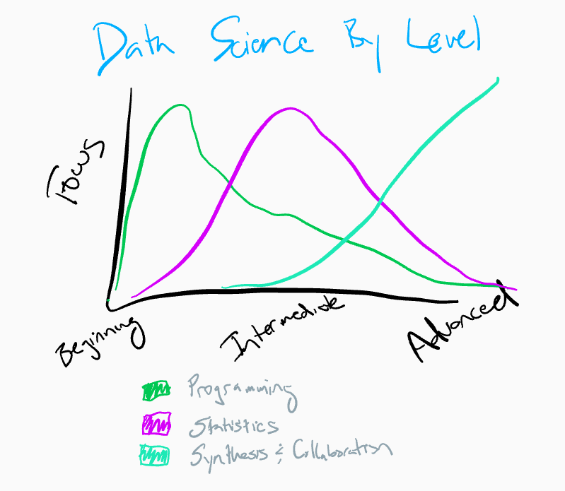

--- 
pagetitle: "Week 16 - Course wrap up"
---

# Week 16

## Advanced Data Science Wrap-up

> Data science is the process of formulating a quantitative question that can be answered with data, collecting and cleaning the data, analyzing the data, and communicating the answer to the question to a relevant audience.

Remember that the best data science always starts with the science, not the data. Start with the question you care about, make sure you think about why and if you should be doing something, and then move forward to data collection and analysis. Being [problem forward, not solution backward](https://simplystatistics.org/2013/05/29/what-statistics-should-do-about-big-data-problem-forward-not-solution-backward/) can take you a long way toward a successful career in data analysis. 

In this class we didn't teach you a collection of methods or a collection of software tools - though we did mention a few along the way. That is because as you move into _advanced_ data science the role of individual technical and statistical techniques is less important than the ability to put them together in a coherent way to tell a story. The focus moves from programming, to statistics, and then to synthesis and communication. 

What has always made this class difficult to both teach and to learn from is that it is less about "the answer in the back of the book" and more about learning a collection of principles that allow you to create, communicate, critique, and support data analytic stories in your professional life. Some of the ideas may not be that useful while you are taking the course, but will likely develop over time. Moreover, the principles we have taught are designed to be general guidelines. Finding the right balance between skepticism and discovery is an ongoing challenge for anyone doing data analysis. 

The most important thing to remember is that there is rarely _one true path_ for a data analysis. It is always about making choices. Even the best laid data analytic plans are subject to the whims of the humans putting those analyses together; this is the heart of the ongoing optimality paradox in data analysis and the reason good data analysis is so hard. The decisions you see in any analysis are dwarfed by those lurking just below the surface. 

Since these choices will always come up and there will be a lot of them, it is helpful to try to perform the simplest analysis you can that gets at a solid answer. The best data analysis is the one that doesn't require complicated statistics at all. 

When you do have to do something more complicated, the best data analysts justify all of their choices, put together stories that connect the dots for consumers, and make their code and analysis easy to follow and reproduce. That way, if others have a different opinion they can always re-do the analysis and try something different. 

There is no way to do a perfect data analysis, you have to try things, fail at them and learn from the mistakes to get good at it. This course has hopefully given you some points to consider and some resources for the future, but the real learning will inevitably come from doing data analysis. With that in mind, one of the best quotes about data analysis is not about data analysis at all. 

> "It is not the critic who counts: not the man who points out how the strong man stumbles or where the doer of deeds could have done better. The credit belongs to the man who is actually in the arena, whose face is marred by dust and sweat and blood, who strives valiantly, who errs and comes up short again and again, because there is no effort without error or shortcoming, but who knows the great enthusiasms, the great devotions, who spends himself for a worthy cause; who, at the best, knows, in the end, the triumph of high achievement, and who, at the worst, if he fails, at least he fails while daring greatly, so that his place shall never be with those cold and timid souls who knew neither victory nor defeat."
> 
>  Theodore Roosevelt, 26th President of the United States

We hope you learned something and look forward to seeing all the great things you do with data during your careers!

## Additional Resources

:::resources

If you are looking for places to learn more from here, a few suggestions are: 

* [Learn more R and Tidyverse](https://www.coursera.org/specializations/tidyverse-data-science-r)
* [Learn how to manage data analysis](https://www.coursera.org/specializations/executive-data-science)
* [R Software Development](https://www.coursera.org/specializations/r)
* [Machine Learning](http://faculty.marshall.usc.edu/gareth-james/ISL/)
* [Interactive R practice](https://swirlstats.com/)
* [What's happening in the field of data science](https://nssdeviations.com/)
:::

